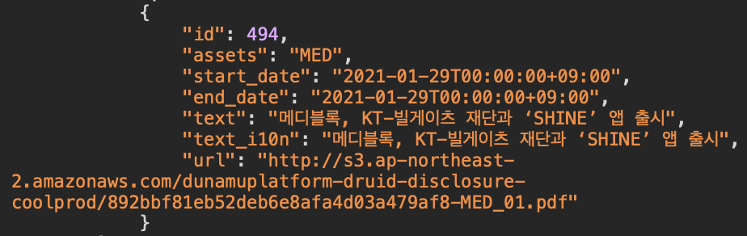
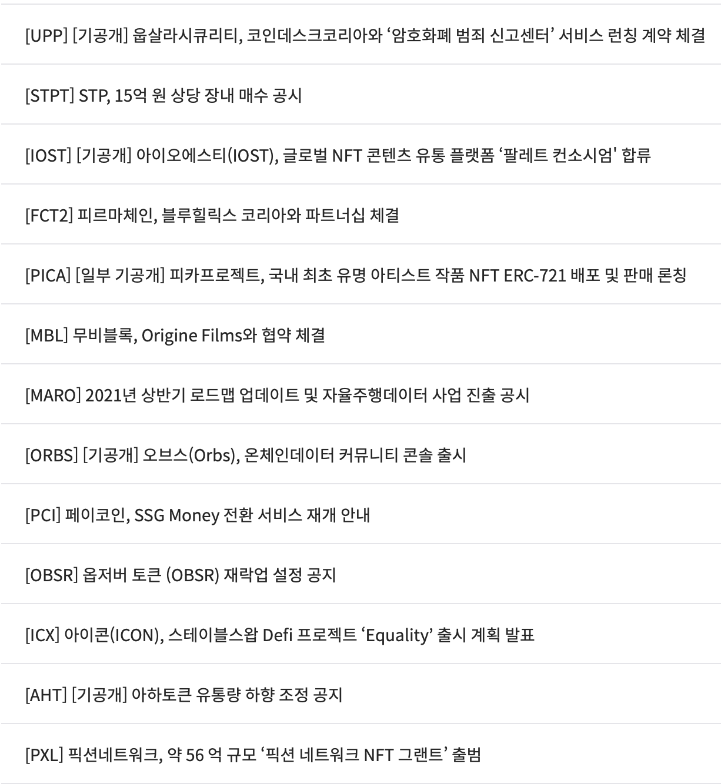
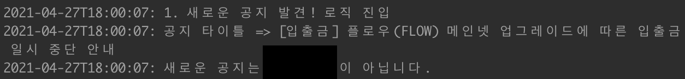

# * 자동매매 코드는 제공하지 않습니다

요즘 아주 핫한 투자 주제인 비트코인 투자를 저 또한 하고있는데요 ㅎㅎ;;
주식에 퀀트가 있듯이 오르는것에 대한 무언가 분석하여 자동매매를 할 수 있을거라 생각했습니다.
물론 승률 100%는 없겠지만 51%만 넘는다고 하더라도 벌 수 있을테니까요! (제 작은 간은 5%만 올라도 팔아야하나? 를 수십번 외쳐서 문제입니다 ㅠㅠ...)

---

## 고민

우선 제가 사용하던 플랫폼은 `업비트` 였고, 처음부터 생각한 아이디어는 복잡한 차트... 를 분석하는 것은 아니었습니다 ^^;
차트로 나오는 데이터를 마이닝 하기위한 스터디, 사전작업 등등이 많고 조금 복잡했었기 때문이죠.

차트는 틱단위, 분, 1시간, 4시간, 일, 월 등등 차트의 종류가 많은데 이를 모두 분석하다가 흥미가 떨어질 것 같았죠.
개발자 분들이라면 아시다시피 사이드 프로젝트는 필이 왔을 때! 빡 만들어야 하기 때문에!!

```json
// 차트 데이터 예시
// 차트 1틱에 대한 데이터 (틱이란? 거래 하나라고 보면 됩니다.)
[{
  "market": "KRW-BTC",
  "candle_date_time_utc": "2021-04-27T06:50:00",
  "candle_date_time_kst": "2021-04-27T15:50:00",
  "opening_price": 64456000.00000000,
  "high_price": 64469000.00000000,
  "low_price": 64455000.00000000,
  "trade_price": 64468000.00000000,
  "timestamp": 1619506224016,
  "candle_acc_trade_price": 68177943.67163000,
  "candle_acc_trade_volume": 1.05764144,
  "unit": 1
}]
```

## 아이디어

차트가 아닌 무언가로 값이 오르고 내릴 수 있는 포인트가 어떤게 있을지 찾아봤을 때, 주식과 다르게 `공지사항`과 `프로젝트 공시`가 데이터에 영향을 준다는 것이었습니다. (이후 공지, 공시로 줄입니다.)

공지, 공시에 대한 open api는 따로 없었고, 업비트 홈페이지에서 사용중인 api가 있었고, 사용하는데 문제는 없있기 때문에 이를 사용하였습니다.

우선 분석을 하진 못하지만 공지와 공시 데이터를 긁어 1분 단위로, 공지 공시가 뜬 시점으로부터 1시간 전후. 총 2시간 데이터를 db에 넣었습니다.
과거 데이터는 합쳐서 약 1000개 단위였고, 분단위로 2시간이면 120개. 최소 12만개 이상의 데이터가 들어가게 되었습니다.

## 문제



문제는 위 이미지처럼 과거 데이터에는 시간(`start_date`)이 명확히 나와있지 않았습니다. (업비트측에 문의를 넣었고, 만들던 도중인 3월 18일 이후 공지부터는 들어가게 되었습니다 ㅎㅎ)

공지가 뜬 시점부터 이전 1시간, 이후 1시간 데이터를 넣어야 하는데 시간이 없어서 당황스러웠죠.
주변 비트코인 투자를 하는 지인들의 도움으로 공시, 공지를 알려주는 텔레그램 봇 방을 알게되어 이를 통해 시간에 대한 보정값을 넣어줄 수 있었습니다.

또한 공시에는 코인 이름을 알려주는 property가 있었으나, 공지에는 코인 이름을 알려주는 property가 없었습니다. (서로 다른 팀이 만들어 관리하는 듯 하다...! 서브 도메인도 다름!)
이를 위해 open api에 있는 `코인이 업비트에 존재하는 코인인지 확인할 수 있는 api`로 영어 키워드를 분석하는 선작업이 추가되어야 했습니다.

## 데이터 분석

이렇게 모아놓은 데이터를 직접 의미있는 데이터로 만들기엔 위에 쓴것처럼 많은 선작업 및 학습이 필요하였고, 흥미가 떨어질 것 같았습니다.
또한, 호재 (상승률이 높은 좋은 소식. 예를 들어 - `카카오페이와 XX코인 협약 체결`) 가 많이 올라오는 공시는 템플릿 형태가 아니었기에 분석하는 것에 어려움이 많을 것으로 보였습니다.



그나마 공지에서 뚜렷한 상승을 알 수 있는 키워드들이 템플릿화 되어 있었습니다.

결국 데이터 분석이라 썼지만, 특정 키워드가 들어간 공지가 올라왔을 때, 아주 높은 상승률을 나타내는 차트가 형성되는 것을 확인하였고,
자주 발생하지 않는 이벤트지만 (약 한달에 1번...?) deep한 분석이 필요한 다른 공시는 모두 포기하고 이런 키워드가 들어갔을 때에만 매수를 진행하자는 결론을 내렸습니다.

## 개발

이러한 결론을 내리기 전까지는 많은 고민의 시간이 있었기 때문에 어떻게든 사용하게 될 모듈들을 먼저 작성했습니다.
매수, 매도를 할 수 있도록 api key셋을 받고 매수 매도를 api를 통해 할 수 있도록 하는 부분을 만들었던 것이죠.

매수, 매도를 만들고 공지를 timer로 확인 및 신규 공지인지 체크하는 로직을 간단히 만들었는데 생각을 거듭할수록 많은 hedging이 필요하다는걸 깨달았습니다.
간단한 토이 프로젝트가 아니라 돈이 오가는 문제이기 때문이죠.

또한 제가 생각한 아이디어는 BTC 마켓에서 거래가 이루어지기 때문에 비트코인을 선제적으로 가지고 있을 필요가 있었습니다.
(원화 마켓 - 우리나라의 통화인 KRW로 코인을 매수할 수 있는 마켓. BTC 마켓 - 비트코인으로 타 코인을 매수할 수 있는 마켓)

따라서 공지를 발견한 후, `신규 공지일 경우 내가 가진 비트코인의 양을 파악하여 환경변수로 넣어놓은 거래하고 싶은 가격과 비교하여 부족할 때 비트코인을 선제적으로 매수`하는 로직을 추가하였습니다.
원화 마켓에서의 구매 단위는 `5000`(원), BTC 마켓에서의 구매 단위는 `0.003`(btc. 약 6000만원 x 0.003 = 18만원) 처럼 달랐기 때문에
이를 컨버팅할 수 있도록 비트코인의 시세를 초단위로 체크하여 in-memory db에 업데이트하였습니다.
또한 비트코인의 시세는 시시각각 변하였기 때문에 비트코인을 구매하고 구매한 비트코인으로 다른 코인을 거래할 때, 비트코인의 찌꺼기 (0.5 btc로 거래하고 싶다고 설정하여도 0.500012 개가 사질 수 있다는 뜻)
가 생길 수 있는 문제가 있기도 했죠. 게다가 거래될 때 수수료도 생각해야되며, 원화 마켓, BTC 마켓의 수수료가 달랐습니다. (원화 마켓 - 0.05%, BTC 마켓 - 0.25%)

이렇게 비트코인을 먼저 구매하였을 때, 위에 기재했듯이 `공지사항은 코인 이름을 알려주는 property가 없습니다.` 이를 확인하는 로직도 추가로 필요했습니다.

`여기까지의 로직은 매수를 할 준비를 하는 로직`이었습니다. 이제 제가 원하는 BTC 마켓의 코인을 거래할 차례입니다.

매수 api를 날리는건 많이 사용하는 rest api입니다. 매수는 무조건 시장가 매수를 합니다.
(시장가 매수란? 매수하려는 값으로부터 위에 쌓여있는 매도 값으로 바로 매수를 하는 것. 반대로 내가 원하는 값에 매수하도록 하는건 지정가 매수.)

이유는 두가지 입니다. 첫번째로는 가격이 내려간 뒤 매수를 하는것이 좋겠지만, 이미 나온 공지를 보고 긁는 것이기 때문에 시간이 없습니다. 두번째로는 매수신청을 체크해야 합니다.
지정가 매수를 했다고 100을 산다고 해놨을 때, 무조건 100이 한번에 매수되어지지 않습니다. 누군가 5만 팔수도 있고, 누군 10, 누군 30,,,, 이런식으로 100이 분할되어 매수될 수 있는 것이지요.
시장가 매수를 하면 한번에 100을 모두 살 수 있기 때문입니다.

하지만, 시장가 매수를 한다해도 불안하기 때문에 모두 매수가 잘 되었는지 체크하는 로직을 추가했습니다. 매수가 끝났으니 끝? 아닙니다.
바로 `매수 평균가의 2배의 가격으로 매도`를 걸어놓습니다. 아니 2배의 가격? 왜 그렇게 해놨지?

이 부분은 데이터를 활용했습니다. 데이터적으론 오히려 적은 수치일 수 있습니다. 제가 캐치하는 이벤트의 키워드가 걸렸을 때, 원금을 포함해 아래와 같은 수치의 데이터를 얻을 수 있었습니다.

```
- 472% (100만원 투자 시, 472만원. 순이익 372만원)
- 336%
- 175%
- 1,722%
- 400%
- 330%
- 1,010%
- 300%
- 292%
...
```

이러한 수치로 매도를 걸어놓는 것까지 개발을 완료하게 되었습니다.

## 환경 작업

이렇게 서비스 로직이 완성되고 그 다음 할일은 로그와 노티, 배포입니다. node 프로젝트였으므로 production에서 많이 사용하는 pm2를 사용하였습니다.
typescript를 사용했으므로 runtime interpreter를 사용하였는데, (트랜스파일링의 귀찮음으로...) 이상하게 pm2의 설정파일인 app.json 설정이 먹히질 않았습니다.
javascript로 바꿔서 하니 잘 되는데 runtime interpreter를 사용하면서 할 때에는 잘 되지 않아서 cli option으로 줄줄이 세팅값을 넣었습니다.

여기서 고민했던건 cluster로 여러 인스턴스를 나눌까? 하는 점이었습니다.
제가 가진 돈의 max치를 매수하도록 해놨을 때, 비트코인의 가치가 급격히 상승한 경우 BTC가 부족하여 비트코인을 매수하는 상황에서 KRW가 부족하게 되는 이슈가 생길 수 있었기 때문에
인스턴스별로 그 금액을 쪼개고 싶었습니다.
하지만 여러 인스턴스가 여러번 open api를 찌를 때, 호출 횟수 제한이 있었기에 (매수/매도 api 제외한 조회성 api는 초당 8번) 리스키했습니다.

결국 1개의 인스턴스로 하였고, 로그, 에러 값을 추가해 상황을 잘 지켜볼 수 있게 되었습니다.

배포는 aws나 서버 호스팅을 고려했지만, 귀찮음이 컸습니다(;;;) 사용한지 오래된 노트북 탓을 하며 맥미니를 구매해 직접 서빙하기로 결정하였고, 재빠르게 m1 chip을 탑재한 맥미니를 구매하여 서비스를 올렸습니다.

노티는 텔레그램 봇을 이용하였습니다.

### 텔레그램

텔레그램 봇은 이미 나와있는 api들이 많았기에 [포스팅](https://gabrielkim.tistory.com/entry/Telegram-Bot-Token-%EB%B0%8F-Chat-Id-%EC%96%BB%EA%B8%B0) 을 참고하여 설정했습니다.

텔레그램을 설치하여 `botfather` 를 친구추가합니다. `start`를 눌러 대화를 시작하면 사용 가능한 커맨드를 나열해줍니다.
대화창에 `/newbot`을 입력하면 챗봇 형식으로 설정에 필요한 값들을 입력하라고 해줍니다.
이에 맞춰 입력하다 보면 채팅방 url과 키값을 얻을 수 있습니다.


이후, `https://api.telegram.org/bot[키값]/getUpdates` 이러한 url을 브라우저에 넣게되면 아래와 같은 값을 얻게 됩니다.

```
{"ok": true, "result": []}
```

그 다음, 채팅방 url에 들어가서 아무말이나 쓴 뒤, 브라우저를 새로고침합니다.

```
{"ok": true, "result": [{"update_id":17831233, "message": {"message_id": 1, "from": {"id": 123456, "is_bot": false, ....
```

메세지에 따른 값이 무언가 추가가 된걸 볼 수 있습니다. 여기서 result.message.from.id가 채팅방의 id가 되게 되는 것입니다.
해당 id로 거래가 됐다거나, 에러가 생겼을 때 텔레그램 api를 쏘게되면? 해당 방에 노티가 가게 됩니다.

```
https://api.telegram.org/bot[키값]/sendmessage?chat_id=[채팅방의 id]&text=[보낼메시지]
ex) https://api.telegram.org/bot123456:ASDFASKDFNJKFFKJASDJDJDJJJ/sendmessage?chat_id=123456&text=TEST
```

---

이렇게 전체 사이드 프로젝트를 완료했습니다.
실제로 잘 돌아가는지 확인해볼까요?




공지 자체는 잘 확인할 수 있습니다만, 1달에 한번 정도 나오는 이벤트인 만큼 바로바로 확인할 순 없고 아직까지 이벤트를 맞닿뜨리진 못했습니다.

오랜만에 재밌는 아이디어로 프로젝트를 진행했는데, 의미있는 결과가 있었으면 좋겠습니다 ㅎㅎ
비트코인 관련 토이 프로젝트 의견이나 대화 환영합니다!!!
