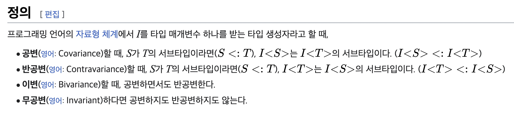
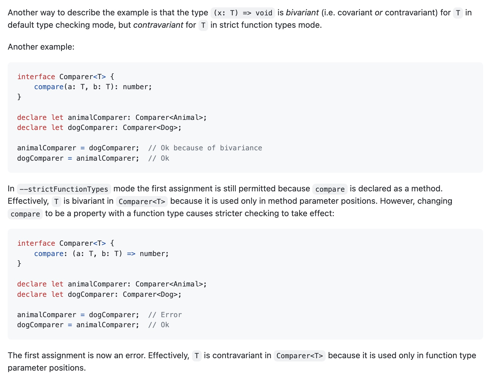

[react의 ref 객체를 업데이트 의존성으로 넣어줘야 할 때](https://jicjjang.github.io/posts/react-useref) 포스트에서

***일반 함수를 useCallback으로 감싸지 않으면 re-render마다 업데이트 됩니다. 여기서 RefCallback은 일반 함수와 동일하다고 생각해주세요. 주석과 bivarianceHack 에 대해선 다음 포스트로 엮어보겠습니다.***

라는 글을 남겼었는데, 이번 포스트를 통해 `bivarianceHack`이 뭔지에 대해 한번 자세히 알아보...기 전에!
타입스크립트를 사용한다면 `bivariance` 라는 용어가 종종 등장하는데, 대체 뭐길래 react에서도, 타입스크립트에서도
자꾸 등장하는지 짚어보고 가겠습니다.

## 공변성, 반공변성, 이변성

우선 이변성을 알기 위해 함께 알아야 할 공변성, 반공변성을 포함해 함께 뜻을 알아봅시다.



[위키백과](https://ko.wikipedia.org/wiki/%EA%B3%B5%EB%B3%80%EC%84%B1%EA%B3%BC_%EB%B0%98%EA%B3%B5%EB%B3%80%EC%84%B1_(%EC%BB%B4%ED%93%A8%ED%84%B0_%EA%B3%BC%ED%95%99))의 내용을 저희가 확인한 주석이 있었던 definition file, 즉 typescript 관점에서 살펴보겠습니다.

- 우선 subtype과 supertype에 대해 알고 가야 합니다. `A`, `B` 라는 타입이 있을 때 `A`타입이 `B`타입을 포함한다면 `A`타입을 supertype, `B`타입을 subtype이라고 합니다.
- 공변성은 supertype, subtype 관계인 `A`, `B` (`A->B`)는 `T<A>`, `T<B>` 형식에서도 supertype, subtype 관계를 유지한다(`T<A> -> T<B>`)는 의미입니다.
- 반공변성은 supertype, subtype 관계인 `A`, `B` (`A->B`)는 `T<A>`, `T<B>` 형식에서는 supertype, subtype 관계가 역전된다(`T<B> -> T<A>`)는 의미입니다.
- 이변성은 공변성, 반공변성의 성질을 모두 가집니다. supertype, subtype 관계인 `A`, `B` (`A->B`)는 `T<A>`, `T<B>` 형식에서는 서로 supertype, subtype 관계를 가집니다. (`T<A> -> T<B>, T<B> -> T<A>`)

```ts
type Variance<T> = (a: T) => void

let a: Variance<string | number> = (a) => {
  console.log(a);
}
let b: Variance<string> = (b) => {
  console.log(b);
}

// 공변성
a = b; // OK
b = a; // Error

// 반공변성
a = b; // Error
b = a; // OK

// 이변성
a = b; // OK
b = a; // OK
```

## typescript에서의 공변성, 반공변성, 이변성

typescript는 기본적으로 값은 공변성을, 함수는 이변성을 유지합니다.

```ts
let convariance1: Array<string | number> = ['1', '2', '3'];
let convariance2: Array<string> = ['1', '2', '3'];

convariance1 = convariance2; // OK
convariance2 = convariance1; // Error

type Variance<T> = (a: T) => void

let a: Variance<string | number> = (a) => {
  console.log(a);
}
let b: Variance<string> = (b) => {
  console.log(b);
}

a = b; // OK
b = a; // OK
```

왜 이런 특성을 갖는지 알아보기 전에, 한번 고민해봅시다.
변수는 `Array<string | number>`타입 안에 `Array<string>`타입 값이 들어가는게(공변성) 맞을까요?
아니면 반대(반공변성)가 맞을까요?

```ts
let convariance1: Array<string> = ['1', 2, 3]; // 맞다면 반공변성
let convariance1: Array<string | number> = ['1', '2', '3']; // 맞다면 공변성
```

값을 직접 넣어 비교해보자면 무조건 공변성이 맞을것 같습니다. 함수도 한번 살펴볼까요?

```ts
type Variance<T> = (a: T) => void

let a: Variance<string | number> = (a) => {
  console.log(a);
}
let b: Variance<string> = (b) => {
  console.log(b);
}

// a = b가 맞다면, a의 타입이 string | number 이므로, number 타입이 값이 들어와도 통과되어야 함
// 약간... 다운캐스팅의 느낌?
a = b;
a(1);

// b는 애초에 string 타입만 됨.
// 약간... 업캐스팅의 느낌?
b = a;
b("1")
```

이런 차이에 대해 생각해봤을 때 똑같은건 아니지만 OOP에 대해 배웠다면 알고있을 `업캐스팅 & 다운캐스팅`이 생각나더라구요.
타입스크립트에선 타입이지만, `업캐스팅 & 다운캐스팅`에선 메서드가 더 있는지 없는지의 차이가 있는거죠.

***글을 작성하면서 검색해봤더니 업캐스팅 & 다운캐스팅이 공변성, 반공변성 특성을 가지고 있는게 맞았네요.***
***다른 언어에서는 공변성, 반공변성을 컨트롤 할 수 있는 방법이 코드 레벨로 있다고 합니다.***

함수에선 기본적으로 반공변성이 맞습니다.
일부러 타입 지정을 위해 타입스크립트를 사용하는데 왜 반공변성이 아닌 이변성을 기본적으로 지정해놨을까요?
설명해보자면 `string | number`타입이 `string`타입을 포함하는게 자명합니다.
그런데 함수가 된다면 `Variance<string>`타입 파라미터를 받는 함수에
`Variance<string | number>`타입의 함수`만` 할당 가능하다는게 모호해지는 것이죠.

그래서 유저가 자유롭게 컨트롤 할 수 있도록 설정과 꼼수와 같은 방법들이 만들어놨습니다.

## 설정 및 꼼수(?)

1. `strictFunctionTypes`

기본적으로 유지하는 공변성에 반하는 특성을 가진 함수형태만 가능하다는게 조금 아쉽지만
타입스크립트 tsconfig 옵션중에 `strictFunctionTypes` 옵션이 있습니다.

위에 공변성 함수 형태와 일반적인 변수 형태 모두 보여드렸는데,
옵션에 있는 이름 그대로 함수 타입의 공변성을 반공변성으로 바꿔주는 역할을 해줍니다.

함수에만 해당되기 때문에 변수는 그대로 출력되게 됩니다.

```ts
// 변수 형태
let convariance1: Array<string | number> = ['1', '2', '3'];
let convariance2: Array<string> = ['1', '2', '3'];

convariance1 = convariance2; // OK
convariance2 = convariance1; // Error

// 함수 형태
type Variance<T> = (a: T) => void

let a: Variance<string | number> = (a) => {
  console.log(a);
}
let b: Variance<string> = (b) => {
  console.log(b);
}

a = b; // Error
b = a; // OK
```

2. 클래스 구조로 코드 만들기

[공식 문서](https://www.typescriptlang.org/ko/tsconfig#strictFunctionTypes)를 보시면 아시겠지만
`strictFunctionTypes` 설정을 만드는 도중 클래스에서 안전하지 않은 부분을 발견했기 때문에, 함수레벨만 고려해서 만들었다고 합니다.
따라서 `strictFunctionTypes` 설정이 되어있더라도 클래스 구조라면 이변성의 특징 그대로 사용이 가능합니다.

```ts
type Methodish = {
  func(x: string | number): void;
};

function fn(x: string) {
  console.log("Hello, " + x.toLowerCase());
}

// Ultimately an unsafe assignment, but not detected
const m: Methodish = {
  func: fn,
};
m.func(10); // OK
```

3. 일반 인터페이스로 사용하기

[strictFunctionTypes 설정을 추가한 PR](https://github.com/microsoft/TypeScript/pull/18654)을 보면 인터페이스에서 가능한 케이스도 정리되어있습니다.

> 왜 docs에는 안써놓은거죠...?



결론적으로 이 둘의 차이는 method 타입에서는 이변성을, function 타입에서는 반변성을 줍니다.

```ts
interface IB {
  // method type parameter position
  b(): void;
}

interface IA {
  // function type parameter position
  a: () => void;
}
```

이는 공변성, 반공변성을 코드 레벨로 컨트롤하는 타 언어와는 다르지만,
필요할 때 아예 사용하지 못하게 막을 순 없으니 편법으로 남겨둔 것이라 여겨집니다.

---

이렇게 공변성, 반공변성, 이변성에 대해 알아봤습니다.
다음 포스트로 react에서의 이변성 hack이 무엇인지 알아보겠습니다.