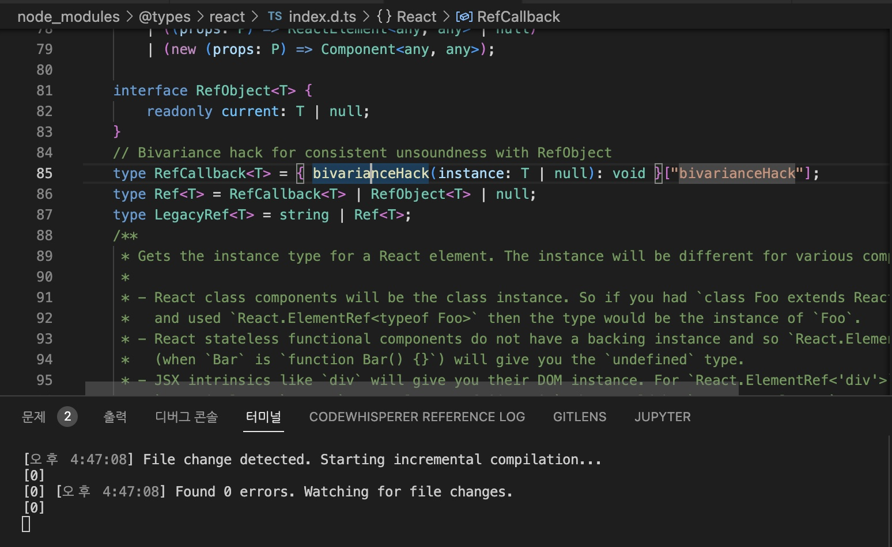
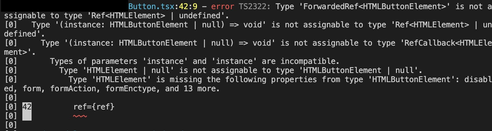

[bivariance(이변성) in react1](https://jicjjang.github.io/posts/bivariance-in-react1) post에서 `bivariance`에 대해 공변성, 반공변성과 함께 알아보았습니다. 이번에는 정말 알고싶었던 ref 타입에서의 bivarianceHack이란게 뭔지 한번 알아보겠습니다.

원래 의문을 가지게 된 코드입니다.

```ts
...
// Bivariance hack for consistent unsoundness with RefObject
type RefCallback<T> = { bivarianceHack(instance: T | null): void }["bivarianceHack"];
type Ref<T> = RefCallback<T> | RefObject<T> | null;
type LegacyRef<T> = string | Ref<T>;
...
```

이 코드는 react dom의 ref 속성에 ref대신 callback function을 넣을 수 있도록 정의된 `RefCallback` 타입입니다.
주석은 직역하자면 `RefObject의 일관적인 불건전함을 위한 이변성의 속임수` 정도로 볼 수 있겠네요.

`bivariance(이변성) in react1` 포스트를 작성하면서 이해한 공변성, 반공변성, 이변성의 성질을 가지고 `불건전함`, `이변성의 속임수`에 대해 한번 같이 알아보겠습니다.

## 불건전함

타입스크립트는 compile time에 확인할 수 없는 코드들이 있는데, 이러한 코드도 안전하게 돌아갈 수 있도록 해줍니다.
이 때, 안전함을 확인할 수 있는 코드를 [건전(sound)](https://www.typescriptlang.org/docs/handbook/type-compatibility.html#a-note-on-soundness)하다고 표현하며, 안전함을 확인할 수 없는 코드를 [불건전(unsound)]하다고 표현합니다.

## 이변성의 속임수

앞선 포스트에서 tsconfig의 `strictFunctionTypes` 옵션의 설정 여부에 따라 function type은 `이변성` or `반불변성`을 가진다는 얘기를 했었습니다.

점점 글을 쓸수록 전 포스트에서 저희가 알아봤던 [설정 및 꼼수](http://localhost:8000/posts/bivariance-in-react1/#%EC%84%A4%EC%A0%95-%EB%B0%8F-%EA%BC%BC%EC%88%98) 에서의 `클래스 구조로 코드 만들기` 와 유사하다는 생각이 듭니다. `설정 및 꼼수`에서 2, 3번은 type과 interface를 확장하는 방식으로 꼼수를 부리는건데 이들은 사실 하나라고 해도 될 정도로 유사합니다.

이 추측이 맞을지 react가 설치된 프로젝트에서 타입을 수정해서 저장했을 때, 에러 발생하는지 테스트를 한번 해보겠습니다.



에러 없이 잘 실행되는 모습입니다.

```ts
  ...
  // Bivariance hack for consistent unsoundness with RefObject
  type RefCallback<T> = (instance: T | null) => void; // Bivariance hack 임시 제거
  type Ref<T> = RefCallback<T> | RefObject<T> | null;
  type LegacyRef<T> = string | Ref<T>;
  ...
```

정상적이었던 코드를 위와 같이 일반 arrow function 구조로 변경했습니다.
어떤 에러가 발생할까요?



dom ref에 등록한 곳이 많았는데, 특정 ref 단 두곳에만 에러가 발생했습니다.
에러가 발생항는 곳은 [forwardRef](https://reactjs.org/docs/forwarding-refs.html)를 사용한 곳이었습니다.

```tsx
...
// 제네릭 타입 2개. 순서대로 ref의 타입과 props의 타입
export const Button = forwardRef<HTMLButtonElement, IButtonProps>(
  ...
  return (
    <StyledButton
      ref={ref} // ForwaredRef<HTMLButtonElement> 타입이 들어감
      ...
```

그럼 dom ref의 타입과 `ForwaredRef`의 타입은 어떨까요?

```ts
interface RefAttributes<T> extends Attributes {
  ref?: Ref<T> | undefined;
}
type Ref<T> = RefCallback<T> | RefObject<T> | null;

// => 합친다면 아래와 같음
ref?: RefCallback<T> | RefObject<T> | null | undefined;
```

dom에서 ref를 받을 때는 RefCallback, RefObject, null, undefined가 가능합니다.

```ts
type ForwardedRef<T> = ((instance: T | null) => void) | MutableRefObject<T | null> | null;
```

값을 넣어주는 ForwaredRef는 일반 함수, MutableRefObject, null이 가능합니다.
이 둘은 반공변성이 성립되지 않습니다.

위 코드를 테스트하면서 이상한 부분을 하나 찾을 수 있었습니다. `dom ref에 등록한 곳이 많았는데, 특정 ref 단 두곳에만 에러가 발생...` 이라는게 뭔가 이상했기에 에러가 발생하지 않는 dom ref도 한번 살펴봤는데요, forwordRef를 사용하는데도 정상적인 부분이 있었습니다...!!!

차이는 dom ref를 받는 곳에서 `ClassAttributes`를 참조하는 부분과 `RefAttributes`를 참조하는 부분이 있다는 것이었습니다. emotion을 쓰면서 생성한 dom은 모두 `ClassAttributes`를 참조하는데 정상적으로 동작하였으며, antd를 사용하며 styled로 한번 컴포넌트를 감싼 결과물은 `RefAttributes`를 참조하고 있었습니다. 이는 에러가 발생하고 있었습니다.

```ts
...
interface RefAttributes<T> extends Attributes {
    ref?: Ref<T> | undefined;
}
interface ClassAttributes<T> extends Attributes {
    ref?: LegacyRef<T> | undefined;
}
...
```

제가 이상하다고 느낀 부분은 이 둘의 타입은 차이가 없다는 것입니다.
`LegacyRef` 타입은 `Bivariance hack for consistent unsoundness with RefObject` 주석이 있을 때 보여드린 코드에도 있지만 `type LegacyRef<T> = string | Ref<T>;` 이렇게 간단합니다.

```ts

...
interface RefAttributes<T> extends Attributes {
    ref?: Ref<T> | undefined;
}
interface ClassAttributes<T> extends Attributes {
    ref?: LegacyRef<T> | undefined;
}
type LegacyRef<T> = string | Ref<T>;
...

// => LegacyRef 타입을 합쳐본다면?

interface RefAttributes<T> extends Attributes {
    ref?: Ref<T> | undefined;
}
interface ClassAttributes<T> extends Attributes {
    ref?: string | Ref<T> | undefined;
}
```

아니 그럼 `RefAttributes 타입과 ClassAttributes 타입의 차이는 string 타입 하나네?` 라는 생각이 절로듭니다.

하지만 RefAttributes타입에 string 타입을 강제로 넣어봐도 에러가 변하진 않습니다...
이 또한 하나의 꼼수일수도 있는 부분인데, `LagacyRef`라는 타입이 굳이 있는 이유일수도 있습니다.

interface, type은 하나의 interface, type을 더 거치면 정확한 타입비교가 안됩니다.

```ts
  ...
  // Bivariance hack for consistent unsoundness with RefObject
  type RefCallback<T> = (instance: T | null) => void; // Bivariance hack 임시 제거
  type Test = RefCallback<T> | RefObject<T>; // 추가됨!!!
  type Ref<T> = Test | null; // 추가됨!!!
  type LegacyRef<T> = string | Ref<T>;
  ...
```

`Ref<T>`가 바로 `RefCallback<T> | RefObject<T>` 타입에 접근하지 않고 `Test`라는 타입을 하나 거치게 했더니 에러가 해결되었습니다.
아마 LegacyRef도 `ClassAttributes`에서 이슈를 해결하기 위해 임시로 만들었다가 계속 사용되게 아닌가 생각이 들더군요.

제가 찾아낸 이런 방법이 `Bivariance hack을 넣을 필요없이 하나 더 거치게 하자` 라고 딱 잘라 말할순 없습니다.
다른 엣지케이스는 없을지 확인해본것도 아니고, 그저 에러하나 없어지도록 확인해 본것이니까요.

---

여기까지 이변성의 속임수가 어떤것인지 확인해봤는데 다른 방향으로 글이 길어졌네요.
결론적으로는 지난 post에서 말했던 `설정 및 꼼수`를 react 타입에서도 사용했다는 것이고, hack은 말그대로 hack이니까 해결할 수 있는 방법은 더 있을 것입니다.
하지만 해결하기 껄끄러우니 hack을 사용한 것일거구요.

주석 하나로 쏘아올린 작은 공... 이라고 해야되나요. 두 편으로 나눠 긴 포스트를 작성해봤습니다.
덕분에 오늘도 react, typescript의 중요한 부분 중 하나를 알고 갑니다.
