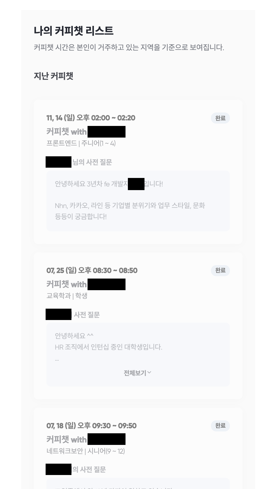

어떻게 알게 되었더라... 항상 스타트업, 창업에 관심이 많은 저는 자주 스타트업 정보에 대해 찾아보고, [thevc](https://thevc.kr/)같은 사이트를 뒤적이곤 합니다.
그러다 우연하게 알게 된 [커피챗](https://coffeechat.kr/)이라는 신규 서비스에 흥미를 느끼게 되었고, 바로 회원가입을 하게 되었습니다.

안그래도 그 당시 [beerware 라이센스](https://ko.wikipedia.org/wiki/%EB%B9%84%EC%96%B4%EC%9B%A8%EC%96%B4)와 해외의 [buymeacoffee](https://www.buymeacoffee.com/)
서비스를 카카오페이 qr로 만들어볼까...? 고민하던 찰나에 [도네리카노](https://donaricano.com/)가 나온 것을 보고 아쉬워했는데
(생각보다 서비스가 안커졌네요... 11/14 기준으로 총참여 크리에이터 900명, 프로필이 등록된 크리에이터는 143명)
또 재미있는 서비스가 나온것을 보고!! 바로 서비스에 파트너로 등록했습니다.

등록 후 확정을 기다렸고, 잠시 후

확정되어 커피챗을 할 수 있는 상태가 되었습니다! 하지만 누군가 신청해줘야 ㅠㅠ 떠들 수 있는 것이었고, 등록해놓고 하염없이 기다릴 수 밖에 없었습니다.

한달 반 정도가 되었나... 까맣게 있고있던 찰나에, 첫 커피챗이 예약되었습니다. 오... 안그래도 재택을 하느라 사람 만날 일이 없던 찰나에 두근두근...!

바로 일정을 선택하였고, 커피챗을 진행할 수 있었습니다.

시간은 20분. 5분정도는 지각할 수 있고, 25분동안 대화를 진행할 수 있도록 도와줍니다.
처음 진행할 때 당시에는 zoom으로 진행을 하였고, 25분 후 방이 폭파 되었지만 최근 진행한 커피챗에서는 커피챗 app에서 진행되었고,
내부에 구성된 음성 대화 시스템을 통하여 커피챗을 진행하게 되었습니다.

지금까지 4번정도의 커피챗을 진행하였고, 4번 모두 사전 질문을 바탕으로 답변 내용들을 준비해 대화를 해봤습니다.
15분정도 준비한 내용을 말하며 5분정도 질문이 위주가 되는 대화였으며, 다들 만족해 하신 듯 하였습니다.

인턴, 신입이신 인사팀 직원, FE로 전직하고싶은 시스템 엔지니어, 저연차 FE개발자 등등 다양한 직군의 직장인 분들과의 커피챗은 저에게도 유익하였고
상대방에게도 유익(했길 바랍니다...)한 시간... 이었겠죠...?
