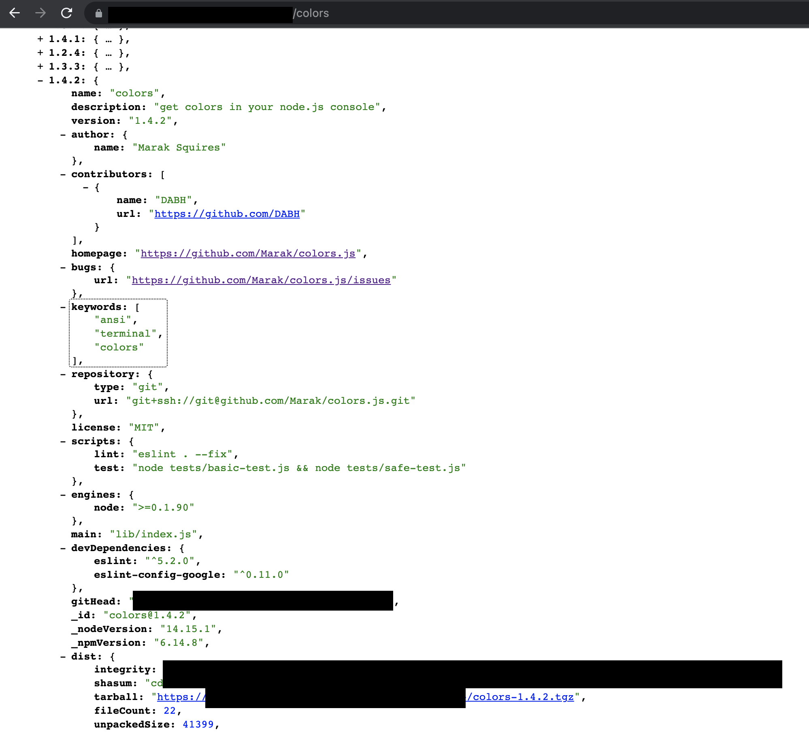
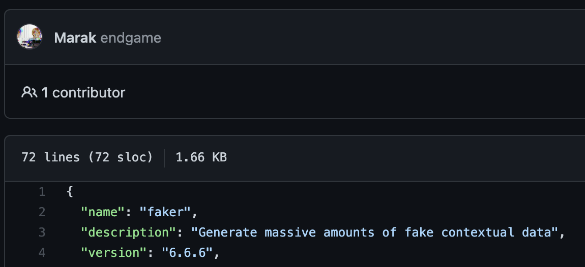

[LINEVOOM web](https://linevoom.me/)을 개발하면서 별도의 모듈로 되어있는 editor 라이브러리의 버전을 올리며, LINEVOOM의 package version을 올리고 PR을 등록했습니다.

여느 때와 다름없는 작업 이었지만 github에 등록된 drone에서 문제가 생겼습니다.

## 문제

왜 private npm에 패키지가 없지...?

`.npmrc` 에 등록된 registry 설정은 private npm slack 채널에서 권고받은대로 설정했기 때문에 의심이 되지 않았습니다.
우선 이미지에 나오는 nexus쪽을 확인해봅니다.

Colors package의 1.4.1, 1.4.2 버전이 싣어져 있습니다. 하지만 압축되어 있는 링크를 클릭하면 404 페이지로 이동하게 됩니다.

그냥 문제라고 치부하기엔 private npm에서 몇번 마주했던 문제와는 사뭇 달랐기에 검색부터 해봅니다.

[https://www.bleepingcomputer.com/news/security/dev-corrupts-npm-libs-colors-and-faker-breaking-thousands-of-apps/](https://www.bleepingcomputer.com/news/security/dev-corrupts-npm-libs-colors-and-faker-breaking-thousands-of-apps/)

`colors.js, faker.js 라이브러리가 수천개의 앱의 의존성을 끊었다`는 문구가 나옵니다. 문제가 가볍진 않아보이네요...

LINEVOOM에서 사용하는 라이브러리에서만 Colors에 의존성을 가지는 라이브러리는 `winston (express logger)`, `@storybook/* (5개)`가 semver룰에 따라 업데이트 되면서 문제가 생겼습니다. 다행히 문제를 만난 1월 13일에는 이미 해당 라이브러리들이 모두 문제를 해결 해놓은 상황이었습니다. 😅 

이밖에도 [aws-cdk](https://github.com/aws/aws-cdk/issues/18323)와 같은 사용자가 엄청난 라이브러리들에도 영향이 발생했습니다. 이런 일이 왜 발생한걸까요? 우리가 생각하는 개발자의 실수가 아닌, [개발자의 의도](https://github.com/Marak/colors.js/blob/master/lib/custom/american.js)였던 것으로 아티클에도 나와있으며, 커밋에도 그 의도를 숨길 수 없었습니다. 또한 [faker.js > package.json](https://github.com/Marak/faker.js/blob/master/package.json#L4)를 본다면 `6.6.6`버전에 `endgame` 이라는 메세지와 함께 커밋이 되어있는 것을 볼 수 있습니다.

해당 개발자 [Marak](https://github.com/Marak) 는 [트위터](https://twitter.com/marak/status/1479200803948830724?ref_src=twsrc%5Etfw%7Ctwcamp%5Etweetembed%7Ctwterm%5E1479200803948830724%7Ctwgr%5E%7Ctwcon%5Es1_&ref_url=https%3A%2F%2Fwww.siliconrepublic.com%2Fenterprise%2Fgithub-marak-squires-colors-faker-npm-corrupt-open-source)를 통해 npm이 문제가 있는 버전을 revert했고, github은 이 user의 접근을 막았다고 하였습니다. Faker.js의 commit은 1개만 있고, 코드가 없는것은 아마 유저의 access가 끊키기 전에 유저가 프로젝트를 제거했기 때문이겠죠.
* [원래 faker.js](http://web.archive.org/web/20210719213152/https://github.com/marak/Faker.js/)는 거대한 양의 fake data를 만들어주는 라이브러리였다고 합니다.

## 추측

이 유저는 20년 11월에 [OSS를 통한 무료 작업을 거부한다는 내용의 글](http://web.archive.org/web/20210704022108/https:/github.com/Marak/faker.js/issues/1046)을 올린적이 있어서 이러한 내용의 연장선이라고 사람들은 추측하고 있습니다.(포춘 500대 기업에 연간 6자리 -> 100,000불 = 1.2억원 정도의 돈을 지불하라고 했습니다.)

faker.js의 README를 보면 `What really happened with Aaron Swartz?` 라는 문구가 있습니다. 프로젝트를 지우는 와중에도 남겨놓은 문구가 궁금해 [Aaron Swartz](https://ko.wikipedia.org/wiki/%EC%97%90%EB%9F%B0_%EC%8A%A4%EC%9B%8C%EC%B8%A0)에 대해서도 찾아봤고, 안타깝게 훌륭한 개발자를 잃게된 [내용](http://blog.creation.net/538)을 찾을 수 있었습니다.

또한 개발자들도 이러한 Marak의 행동에 대해 기업들이 기여(개발, sponsor...)하지 않고 개발을 요청하는 것에 대한 도덕적 책임감을 가져야 한다는 얘기를 하고 있습니다.

## 결론

물론 많은 의존성을 가진 OSS 프로젝트를 다루는 개발자가 책임감을 버린다는 것에 대해 안타깝고, 그러한 반응을 보인 유저들의 github issue와 PR 댓글로 많이 보이지만 한편으로는 얼마나 자신의 목소리를 내고 싶었으면 저런 결정까지 하게 되었을까 생각하게 되었으며, 프로젝트를 만들며 무분별하게 dependency를 늘리는 스스로에 행동에 대해 돌아보는 계기가 되기도 하였습니다.
