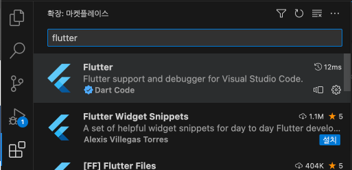
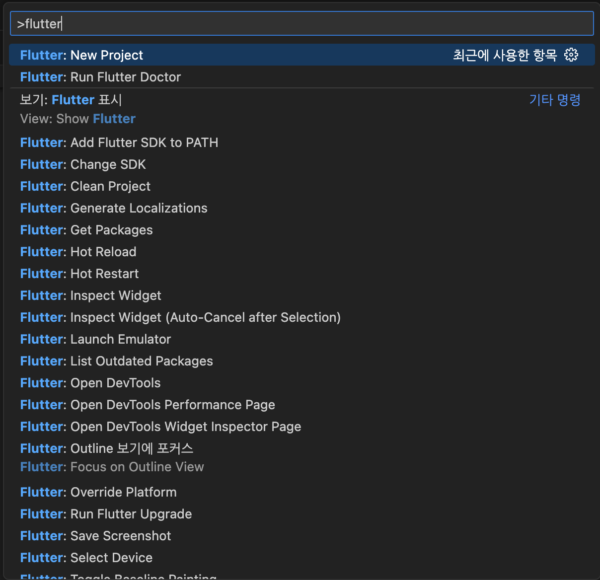
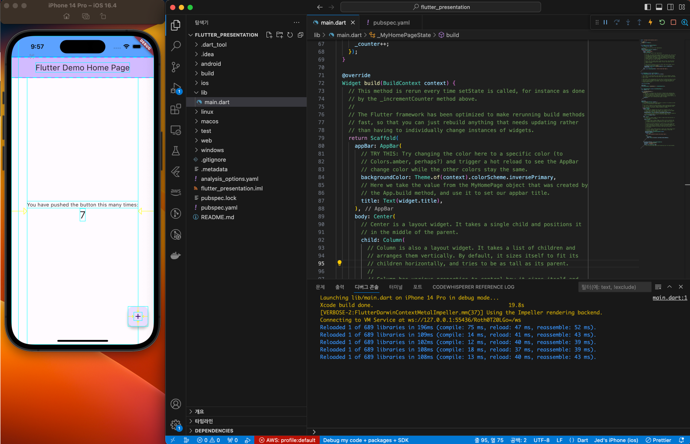
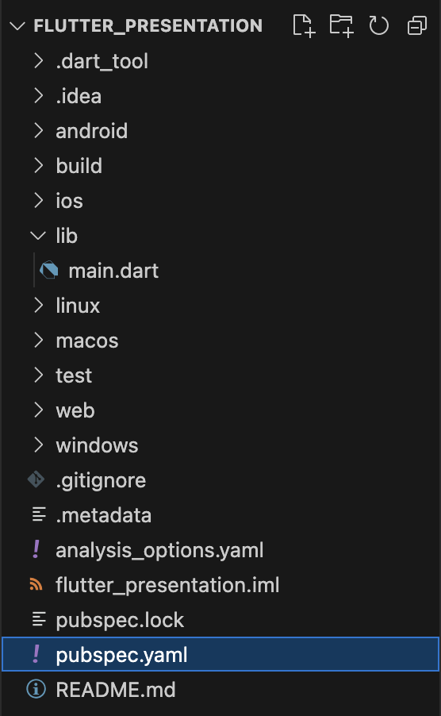
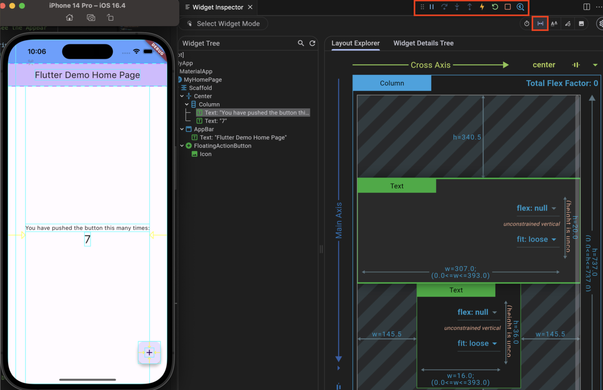

### 왜 플러터를 선택할까??

- Native
    - 성능은 제일 좋으나 두개의 플랫폼을 대응해야 하고 손이 너무 많이감
    - 여러 다른언어와 환경을 배우기엔 시간이…
- KMM (Kotlin Multiplatform Mobile)
    - [KMM to flutter](https://engineering.linecorp.com/ko/blog/demaecan-2nd-recode-kmm-to-flutter) 중 `두 번째 Recode를 시작한 계기` 참고
    - 안드로이드 개발자도 적응이 쉽지 않고, ios로 빌드 시 Kotlin → Object-c 변환 중 디버깅 시행착오가 점점 늘어남
- React-Native
    - React를 하는 우리 입장에서 제일 적응하기 수월하고 쉬움
    - 하지만 device 기능 사용시 성능 저하는 이미 모두가 알고있는 사실
- Flutter
    - 도전해볼만 하다 판단됨
    - React-Native보다 device 기능을 사용하는데 용이함

### 시작하기

- 개발 문서는 공식 홈페이지가 쉽게 잘 나와있음
    - [flutter 공식 홈페이지](https://docs.flutter.dev/)
- 설치
    - [flutter 설치](https://docs.flutter.dev/get-started/install/macos?tab=ios14)
    - silicon m1칩 주의가 필요!
    - ios, android 시뮬레이터를 설치하는 방법도 별도로 나와있음
        - 옛날처럼 android studio에서 따로 열어주고 하는 별도의 액션이 필요 없음
    - vscode로 개발합니다!!
        - 오히려 android studio보다 쉽고 빠름
        - 공식 플러그인도 있음. 설치 시 프로젝트를 쉽게 만들고 실행할 수 있음
        

### VScode with flutter

- 프로젝트 생성

- 기본 프로젝트 생성 및 시뮬레이터를 띄우고 debug 모드로 실행

    - counter 앱이 기본적으로 생성됨
- 디렉토리 구조
    - lib/main.dart
        - c, c++ 처럼 `main(){…}` 함수부터 프로그램이 시작됨
        - lib 디렉토리가 웹에서의 src 디렉토리라고 보면 됨
    - pubspec.yaml
        - package.json과 같음. 패키지 매니징을 위한 파일
    - android / ios / web/ windows / maxos
        - 빌드되어서 각 환경에 맞는 코드가 들어가게 됨
    
- 앱을 실행시키면 빨간 네모와 같은 프로젝트 컨트롤 버튼들이 생김
    - 제일 오른쪽에 있는 버튼은 devtools inspector 페이지 버튼
    - 해당 버튼 클릭 후 아래 있는 빨간 네모 버튼을 누르면 시뮬레이터에 그리드가 잡힘
    - 또한 탭 아래 `Select Widget Mode` 버튼을 누르면 시뮬레이터에서 속성을 선택할 수 있음
    

### 개발

- 웹 개발시의 `컴포넌트`를 flutter에선 `위젯` 이라고 부름
- project에서 기본으로 만들어지는 프로젝트를 살펴봅시다

```flutter
import 'package:flutter/material.dart';

void main() {
  runApp(const MyApp()); // runApp은 기본 flutter의 함수. 프로젝트를 실행해줌.
}

class MyApp extends StatelessWidget { // StatelessWidget은 state 변수를 사용할 수 없음
  const MyApp({super.key});

  @override
  Widget build(BuildContext context) {
    return MaterialApp( // 구글의 머테리얼 앱 디자인을 기본으로 차용
      title: 'Flutter Demo',
      theme: ThemeData( // 테마는 디자인 시스템이라고 생각하면 됨
        colorScheme: ColorScheme.fromSeed(seedColor: Colors.deepPurple),
        useMaterial3: true,
      ),
      home: const MyHomePage(title: 'Flutter Demo Home Page'), // class에 new는 생략함
    );
  }
}

class MyHomePage extends StatefulWidget {
  const MyHomePage({super.key, required this.title}); // title을 파람으로 넘겨받음

  final String title;

  @override
  State<MyHomePage> createState() => _MyHomePageState();
}

// StatefulWidget은 이런식으로 class가 두개로 나뉘어서 사용됨
// 그럼 title을 쓰려면? widget.title로 접근해야됨.
class _MyHomePageState extends State<MyHomePage> {
  int _counter = 0; // 이런 일반 변수가 state 값임. setState를 통해 값을 바꾸면 rerender

  void _incrementCounter() {
    setState(() {
      _counter++; // 상태 업데이트 시, setState로 감싸줘야 함. 이렇게 안하면 rerender가 안됨
    });
  }

  @override
  Widget build(BuildContext context) {
		// Material design을 기본으로 가져갈 때
		// 화면의 노치와 같은 부분을 어디까지 잡아줄지? 맞춰주는 역할
    return Scaffold(
      appBar: AppBar(
				// MaterialApp에서 넣어준 컬러 스킴 값.
        backgroundColor: Theme.of(context).colorScheme.inversePrimary,
				// StatefullWidget에선 title을 쓰기 위해선 widget.* 으로 접근해야됨
        title: Text(widget.title),
      ),
      body: Center(
        child: Column(
          mainAxisAlignment: MainAxisAlignment.center,
          children: <Widget>[
            const Text( // const는 변수가 없을 때 들어감
              'You have pushed the button this many times:',
            ),
            Text(
              '$_counter',
              style: Theme.of(context).textTheme.headlineMedium,
            ),
          ],
        ),
      ),
			// MaterialApp 이므로 플로팅버튼을 설정할 수 있음
      floatingActionButton: FloatingActionButton(
        onPressed: _incrementCounter,
        tooltip: 'Increment',
        child: const Icon(Icons.add),
      ),
    );
  }
}
```

### 이후 개발 방향

- 기본적으로 어떤 위젯이 있는지??
    - [링크](https://docs.flutter.dev/ui/widgets)
    - 웹과 비슷하게 기본적으로 사용되는 위젯, 컴포넌트는 비슷함 (Column, Row, Container, Text, Image.asset, Image.network, …)
    - 중요한건 아키텍쳐
        - 컴포넌트를 어떻게 나누고, 함수, 기능, 미들웨어 등등 어떻게 빼놓을것인지?
        - 웹과 다르게 앱은 에러로 인해 죽을 수 있음 ㅠㅠ…
- FCM…
    - 이게이게… 복잡합니다… ㅋㅋㅋㅋㅋ
- Firebase Analytics
- Firebase Crashtics
- …
- 릴리즈의 길은 멀고 험하다…