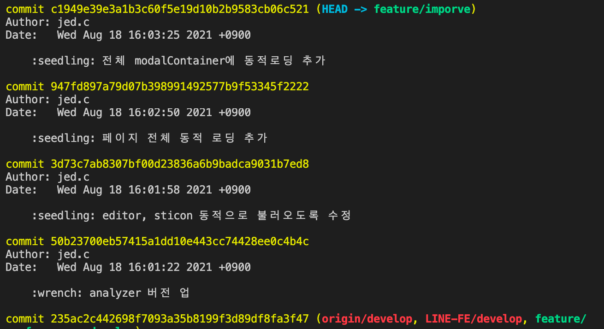
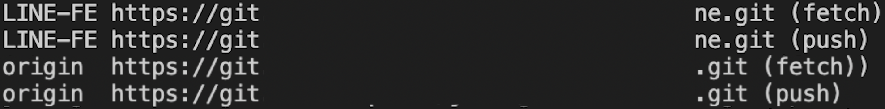

오늘도 바쁘게 업무 태스크를 처리하고 있었습니다.

git branch에서 작업하는 순서는 git-flow 전략에 맞게 브랜치를 하나 생성하고 (`git flow feature start feature/improve`)
하나의 업무를 처리하고 Git으로 회사 서버에 add/commit/push하는데 (`git add . / git commit -m '...' / git push origin feature/improve`)

어랏...

갑자기 push를 하는데 아래와 같은 에러가 발생했습니다.

Commit까지 모두 잘 마쳤고, 로그를 확인했을 때 모두 들어갔음을 확인할 수 있었습니다.

구글링 할 키워드가 `error: failed to push some refs to '*.git'` 였지만, 이를 바탕으로 검색했을 때에는 배부분 `git pull`을 먼저 하라는 기본적인 포스트가 많았습니다.

결국 [참고](https://rrecoder.tistory.com/88) 할만한 포스트를 찾았으나, 근본적인 해결책을 제시해주진 못했습니다.

---

확인해본, 생각했던 방법으로는
1. remote repo

remote repo에 문제가 없나 기본적으로 살폈으나, remote 쪽 설정은 보통 프로젝트 초반 이후엔 잘 안건들기 때문에 문제가 없을 것으로 예상했고, 예상대로였습니다.

2. 다른 브랜치도 동일하게 비정상적 동작을 하는지

바로 develop브랜치로 전환 후, `git pull / git push`를 해봤더니 아주 잘 되고 있었기 때문에 원인은 더 오리무중...

3. git fetch

`git fetch` 명령어는 로컬 브랜치를 리모트와 싱크해주는 기능입니다. 혹시나 하는 마음에 해봤으나, 아무 반응이 없었습니다.

4. git reset

사실 해결 가능할 것 같은 부분이었으나, 확실한 방법으로 해결하기 위해 스킵한 부분입니다.
아마 `develop` 브랜치가 가리키고 있던 `234ac2` 커밋으로 reset을 하면 커밋되었던 파일들이 staging 될 것이고, 전체 `stash` 및 다른 브랜치로 옮긴 후 `stash pop`, 이후 Commit, push하면 끝.

5. git cherry-pick

참고 포스트에서도 동일한 방법으로 해결했더군요. 저도 이 방법으로 해결하였습니다.
적지않은 시간의 작업 및 커밋을 쌓아놓은 상황에서 Commit한 브랜치가 깨졌다는 것에 꽤 불안한 상황이었기 때문에 `50b237` Commit부터 `c1949e` Commit까지 하나하나 cherry-pick을 진행했습니다. 자주 사용하는 기능이 아니었던 만큼 바로 `c1949e` Commit까지 갈 용기는 없었습니다 ㅎㅎ;

---

근본적인 해결책은 발견하진 못했지만, 처음 겪어보는 상황에 블로그 업데이트 생각부터 바로...! 어려운 이슈는 아니었지만, 처음 겪는 상황에 당황할만한 이슈였습니다.
