## 서두

FE 개발을 하는 저희는 package.json을 이용하여 Node의 의존성 관리 도구인 npm을 사용하고 있습니다.

여기에는 여러 의존성이 설치되는데요, 기본적으로 프로젝트를 한다고 하면 비동기 통신을 하는 axios, url의 query를 파싱해주는 query-string, typescript, @types/*, nodemon, pm2 등등등... 

한도끝도 없는 많은 package를 관리합니다. 이런 의존성은 package.json에 미리 기재만 해놓는다면 `npm install`이란 명령어로 간단하게 설치가 됩니다. 저희가 프로젝트를 한번 할 때 의존성이 수십개가 됩니다. 그렇다면 저희가 설치한 프로젝트 또한 수십개를 가지고 있겠죠? 설치는 간단하지만 그 내부는 어떨까요? 복잡한 트리 구조 형태가 됩니다.

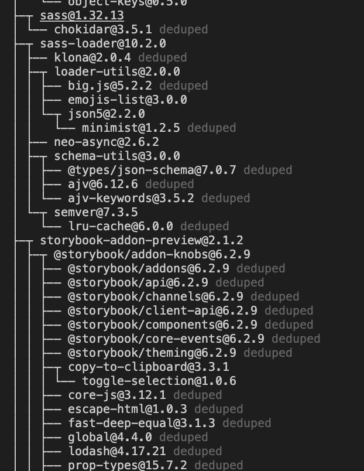

> `npm ls` 명령어로 간단히 확인할 수 있습니다.
> `dedupe` 이란? https://docs.npmjs.com/cli/v7/commands/npm-dedupe

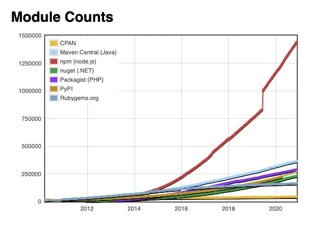

> 또한 npm 패키지 크기는 넘사벽...

`npm install`로 설치된 의존성 패키지들은 어디로 갈까요? 바로 node_modules로 갑니다. 여기서 고민을 한번 해봅니다.

## 고민 (이라기 보단 궁금증 ㅎㅎ 보이지 않는 부분!)

1. 저는 프로젝트 C에서 작성된 package.json 파일을 바탕으로 `npm install`명령어를 오늘했고, 팀원 A는 `npm install`을 2일 뒤에 한다고 가정했을 때, 이틀 사이에 프로젝트 C 에서 사용하는 axios가 업데이트 됐습니다. 두 팀원의 node_modules 내부의 axios 버전은 어떻게 되어있을까요?

2. A라는 의존성 패키지 내부에서도 axios를 사용할 수 있고, B라는 의존성 패키지 내부에서도, 심지어 프로젝트에서 직접 axios를 사용할 수 있습니다. 하지만, 트리구조가 된다면 이러한 상황에서 axios가 3개가 되는게 맞겠죠. 하지만 겹치는 라이브러리를 모두 들고갈 필요가 있을까요?

---

어느 순간부터 install이 될때마다 `package-lock.json`이란 부산물(?)이 나오기 시작합니다.

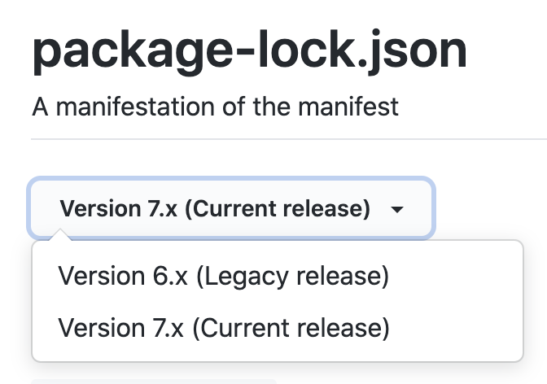

> 생각보다 package-lock.json이 추가된건 얼마 되지 않음

### 고민1

우선 `고민 1`부터 얘기해 보겠습니다. 두 팀원의 버전이 차이가 날 수 있었던건  [`semver`](https://semver.npmjs.com/) 라고 하는 룰 때문입니다. 바로 버전에 range를 줘서 어느정도의 업데이트에 대응할 수 있도록 해주는건데요, range가 있기 때문에 버전이 업데이트 됐을 때 그것을 따라가기 때문에 팀원끼리 의존성의 버전 차이가 생기기도 하는 것입니다.

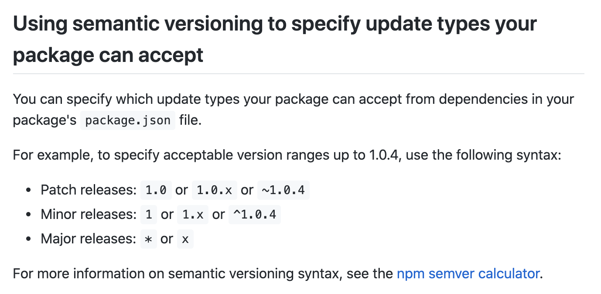

이 부분을 `package-lock.json`을 통해 해결하였습니다. github에 함께 올라온 `package-lock.json`을 보고 팀원들의 의존성 버전들이 어떻게 되어있는지 알 수 있게 된 것이죠.

### 고민2

이 부분 또한 `package-lock.json`을 둠으로써 해결합니다. 겹치는 범위(or 동일 패키지의 가장 높은 버전)의 package는 1개로 node_modules 바로 하위에 두고 관리하는 것입니다. 그렇다면 semver의 영역에서도 겹치지 않는 패키지는 어떻게 될까요?

테스트를 해보겠습니다. `query-string` 패키지와 `filter-obj` 패키지를 설치합니다. `filter-obj`는 `query-string` 내부에서 사용되는 라이브러리이며, `query-string` 내부에서는 `1.0.1` 버전이, 직접 설치한 `filter-obj` 는 `2.0.2` 버전이 설치됩니다.

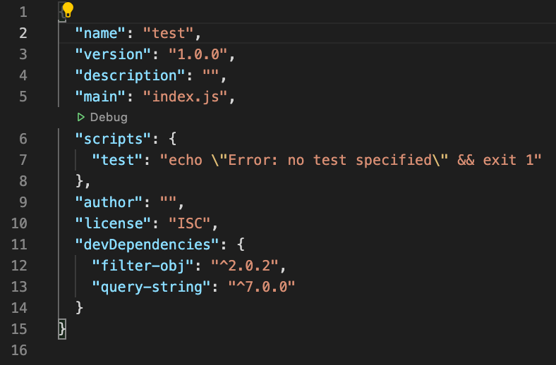

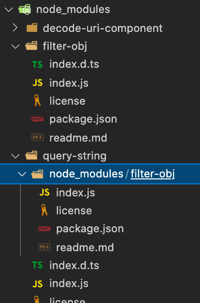

이렇게 버전이 다른 패키지가 설치되는 경우엔 node_modules 내부에 하나, 버전이 작은 패키지의 하위에 사진처럼 node_modules가 생기게 됩니다.

결국 npm이 `package-lock.json`으로 관리하려고 했던건 중복된 라이브러리의 단일화와, 협업 과정에서 사용되는 의존성 패키지의 일관성입니다. 

## Potential security vulnerability, 잠재적 보안 취약점

`package-lock.json`의 장점들에 대해 지속적으로 알아봤는데, 해결해야 하는 부분들이 남아있습니다. 바로 github에서 알려주는 잠재적 보안 취약점 입니다.

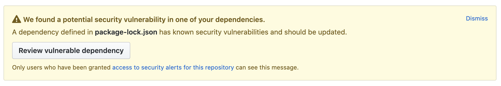

github에서 자체적으로 알려주는 이 기능은 `package-lock.json`을 기반으로 보안상 허점이 있는 라이브러리에 대해 업데이트 하라는 경고를 주는 것입니다. 그렇기 때문에 오래된 프로젝트, 오래된 라이브러리들의 repogitory에 들어가면 여지없이 떠있게 되죠...

이를 간단하게 해결할 수 있는 부분들과 문제점에 대해 알아보겠습니다.

## Command

몇몇 간단한 커맨드로 이슈들을 가볍게 진단 및 수정해볼 수 있습니다.

```sh
$ npm outdated
```

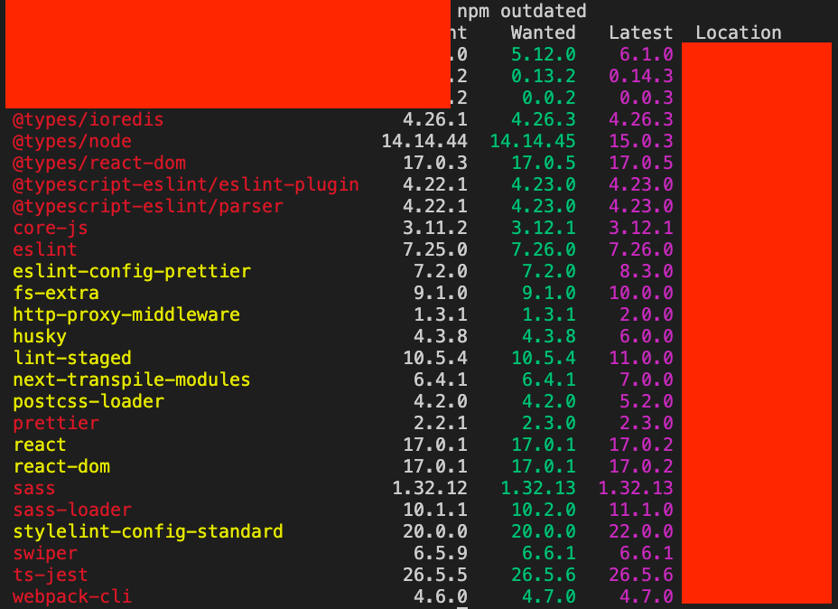

> 업데이트가 필요한 라이브러리들을 보여줍니다.

```sh
$ npm update
```

> outdated에서 보여준 패키지들을 모두 업데이트 해줍니다. 하위호환 문제가 생길 수 있습니다.

```sh
$ npm audit fix
```

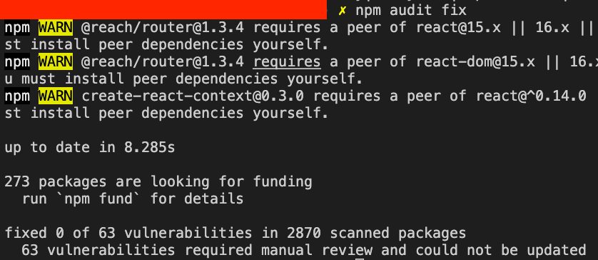

> 모듈들의 취약점 검사를 해줍니다. fix가 없으면 report만 발행해 주면, fix args가 붙어있다면 자동으로 취약한 package를 최신버전으로 업데이트 해줍니다.

## 문제

여기까지 간단하게 해쳐왔으나 `의존성 패키지 내부에서 사용하는 패키지의 버전 이슈` 가 남아있습니다. 프로젝트 내부에서 사용하는 라이브러리 업데이트를 하지 않은 경우에 어떻게 해야 할까요?

사용하는 의존성 패키지 내부를 유저가 직접 바꿔서 사용하기란 사실상 불가능합니다... (로컬에서 수정해서 사용하는 이상한 짓을 하지 않는 이상...)

믿고있었던 `npm audit` 명령어를 다시한번 보자면...


> 수정된건 0건...

현재 프로젝트에서 발생하는 이슈를 자세히 보여드리겠습니다.

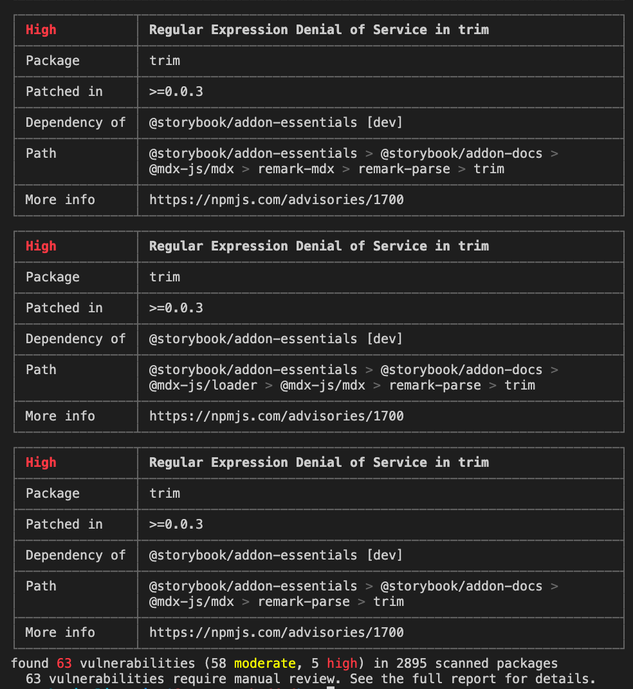

`npm audit` 리포트에서 나온 부분입니다. 문제가 되는` trim` 라이브러리를 사용하는 `@storybook/addon-essentials`라이브러리를 기준으로 보겠습니다. 

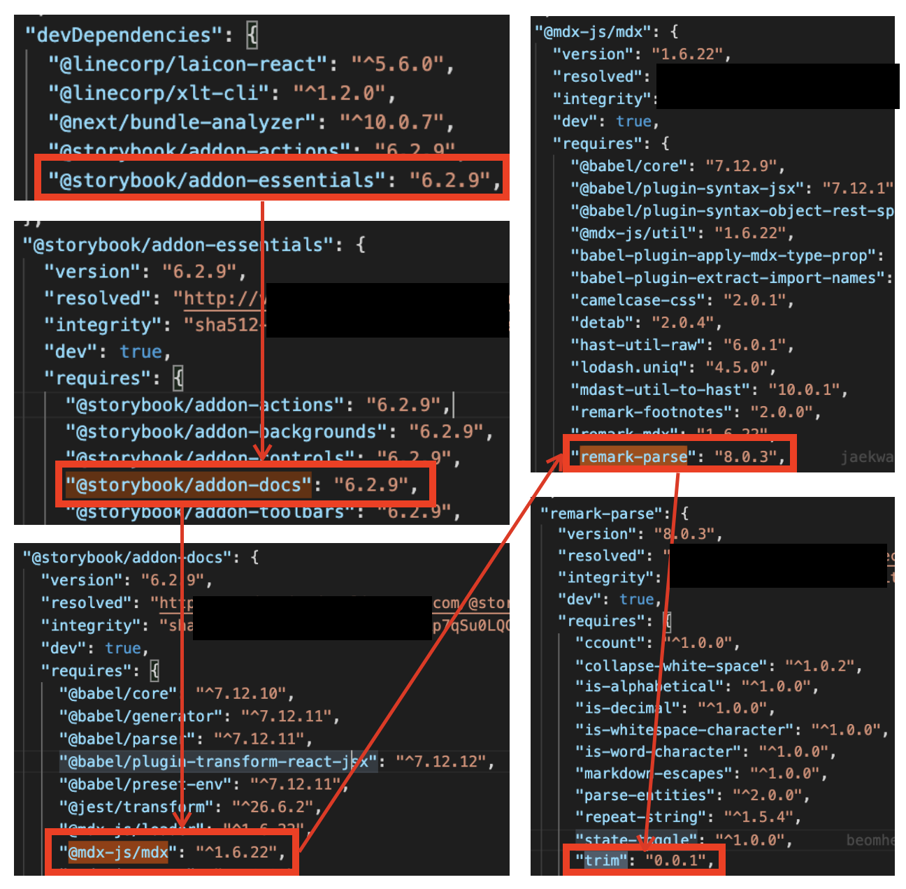

github에서는 0.0.3 버전 이상으로 올리라고 경고를 주었지만, 실제로 사용하고 있는 `@storybook/addon-essentials` 라이브러리 (사진에 있는 v6.2.9가 최신) 자체에서 그 미만인 버전의 `trim` 라이브러리를 사용하고 있기에 해결할 수 없습니다.

## 결론

사실, 위와 같은 문제가 있는 라이브러리를 제외하곤 `npm update` or `npm audit fix` 명령어로 문제가 대부분 수정 가능합니다. 또한, `npm audit` 명령어를 지원하지 않는 Nexus registry의 이슈도 verdaccio로 변경함으로써 수정이 되었구요.

결국 오픈소스에 이러한 마이너 이슈를 수정해달라는 이슈 제기 or pull request을 함으로써 해결이 가능할 것입니다.

잠재적 보안 취약점에 대해서는 지속적으로 체크하는 방법말곤 사실상 해결책은 없다고 생각합니다.
[npm-check-updates](https://github.com/raineorshine/npm-check-updates) 라는 라이브러리도 있긴 하지만, 한번에 업데이트가 일어남으로써 문제가 생기는 (실제 이 글을 작성하면서 npm update를 했더니 eslint가 7.20.0 -> 7.26.0으로 업데이트 되며 문제가 생겼었습니다) 부분을 자동으로 모두 해결해줄 것이란 보장도 없으니까요.

프로젝트에 대한 지속적인 관심과 유지보수, 정책(`ex - 매주 수요일엔 잠재적 보안 취약점 업데이트의날`)이 필요할 것으로 보입니다.

---

## 참고

유저가 신경 쓸 필요 없이 자동으로 해결할 수 있는 자구책은 찾지 못했지만, 조금이라도 더 눈에 띄도록 하여 수정해야한다는 노티를 강화한 플러그인이 있습니다.

[dependabot](https://dependabot.com/)인데요,

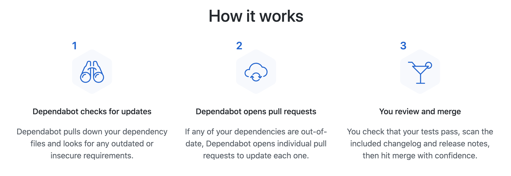

1. dependency에서 이슈(보안 이슈, out date)를 찾음
2. 이를 업데이트하는 pr을 올림
3. 유저가 리뷰 및 머지

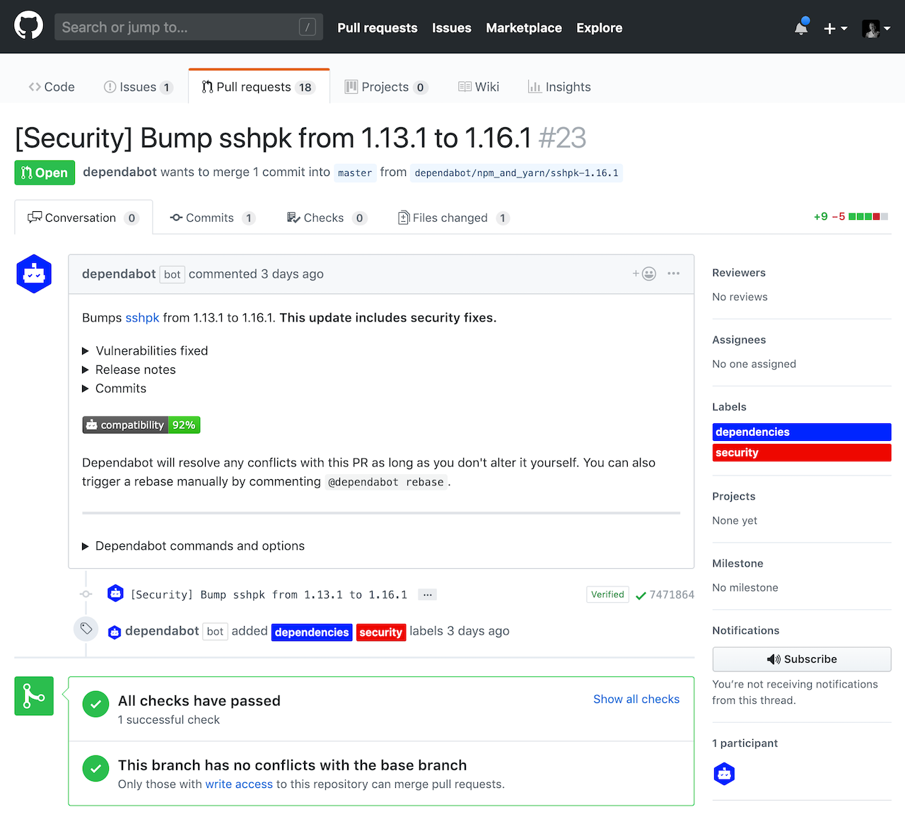

결국 유저가 리뷰 및 머지를 해야하지만, 과정을 간단하게 해주기 때문에 약간의 해결책이 될 순 있을 것 같습니다.