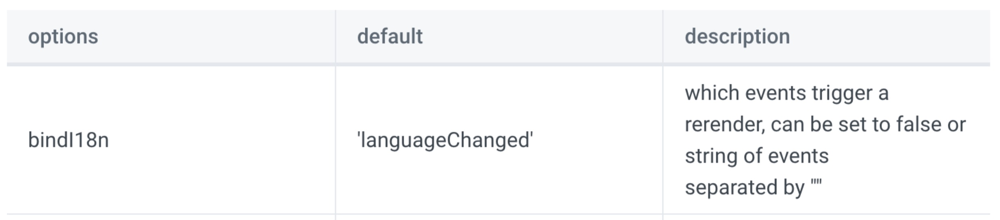

사실 레퍼런스도 많고 다국어 적용 시 필수적으로 사용하는 [`i18next`](https://www.i18next.com/)는 이미 알려질대로 알려진 유명 라이브러리지만, 실제로 사용해 본 경험은 없습니다.
globally한 개인 프로젝트를 해본적이 없었고, 라인플러스에 재직 시에는 사내 다국어 대응 라이브러리인 `XLT`를 사용했기 때문에 `i18next`를 실제로 사용해 볼 기회가 마땅치 않았습니다.

마침 회사에서 사용해볼 기회가 있었는데요. lerna monorepo 환경으로 여러 프로젝트와 여러 라이브러리들이 있는데, 전체적으로 한번에 적용하는 상황이었습니다.
프로젝트가 라이브러리들을 사용하기도 하고, 프로젝트가 다른 프로젝트 파일을 가져오기도 합니다.

```js
project
 ㄴ packages
    ㄴ project1 // library1, library2를 사용
    ㄴ project2 // project1, library1, library2를 사용
    ㄴ library1 // 다른 라이브러리 사용하지 않음
    ㄴ library2 // 다른 라이브러리 사용하지 않음
    ㄴ ...
```

처음 적용했던건 project1이었고, project1에서 가이드에 맞춰 i18next, react-i18next 라이브러리를 추가해 작업을 진행하였습니다.

---

### i18next 설정

우선 i18next를 설정해보겠습니다.
```ts
import i18n from 'i18next';
import LanguageDetector from 'i18next-browser-languagedetector';
import { initReactI18next } from 'react-i18next';
import * as en from './en.json';
import * as ko from './ko.json';

i18n
  .use(initReactI18next)
  .use(LanguageDetector)
  .init({
    resources: {
      en: {
        namespace: en,
      },
      ko: {
        namespace: ko,
      },
    },
    debug: true,
    ns: 'namespace', // resources에 들어갈 namespace 이름
    defaultNS: 'namespace', // 여러 namespace가 있을 수 있는데, 기본으로 사용할 namespace
    keySeparator: '.', // 번역 파일을 {} 형식으로 구성하고 keySaparator를 통해 접근이 가능
    interpolation: {
      escapeValue: false, // xss 취약점을 막아주는 옵션으로 기본 true이나, 번역을 통해 html 태그가 들어갈 수 있음
    },
    // i18n-scanner plural 키 지원
    // https://github.com/i18next/i18next-scanner/issues/228#issuecomment-1169740402
    compatibilityJSON: 'v3',
    react: {
      bindI18n: '', // prevent react-i18next rerender
    },
  });

export default i18n;
```

`.use()` 형식은 express의 middleware와 동일합니다.
브라우저의 언어를 인식할 수 있도록 `i18next-browser-languagedetector 라이브러리의 LanguageDetector` 를 추가했고, react의 hooks을 사용하기 위한 `react-i18next` 라이브러리도 추가했습니다. 그리고 `i18next.ts`파일을 next.js의 시작점인 `_app.tsx`에서 호출하도록 설정해줍니다.

이제 번역이 필요한 text들에 대해 i18next를 적용해보겠습니다.

```tsx
// tsx file
const { t } = useTranslation();

return <CustomError
      statusCode="500"
      title={t('500Error', 'Something went wrong...')} />; // 기본값 포함

// en.json
{
  "500Error": "Something went wrong..."
}

// ko.json
{
  "500Error": "서버에 문제가..."
}
```

`react-i18next`를 사용했기 때문에 useTransloation 을 사용했지만, `<Trans>` 태그를 사용할수도 있습니다.

이제 한국어, 영어를 토글할 수 있도록 설정이 필요합니다.
`i18next-browser-languagedetector 라이브러리의 LanguageDetector`는 브라우저의 언어를 확인해주는데,
cookie, 브라우저 스토리지들, query string, path 등등의 미리 정의된 키값에 언어값을 넣으면 해당 언어를 통해
브라우저의 언어가 바뀌었다는걸 판단하고 업데이트 해줍니다.


창이 닫혀도 언어가 바뀌는걸 원치 않으니 localStorage의 `i18nextLng` 키에 특정 버튼을 토글하면 언어가 `en`, `ko`로 바뀌도록 설정해줍니다.

---

### react-i18next 제거

next.js를 사용하고 있지만, api에서 내려오는 text는 서버에서 직접 번역에서 내려주기 때문에 SSR 시점에 별도로 다국어를 지원하는 부분은 없어서 react-i18next로 결정을 했습니다.
SSR 시점에도 다국어 지원이 필요하다면 `next-i18next`를 사용할수 있습니다.

그런데, 제가 사용한 `react-i18next` 라이브러리는 hooks나 jsx 태그 형식을 차용하기 때문에 언어를 바꿨을 때 바로 rerender가 발생하며 텍스트들이 변환되었습니다.
문제는 api응답으로 내려받아 넣은 text들은 업데이트가 되지 않는 점이었는데요, 이 문제는 팀 내 의견을 통해 언어 토글 시 새로고침이 되도록 수정되었습니다.
하지만 0.3~0.5초 정도 언어가 토글이 되는게 보이면서 새로고침이 발생하였습니다.

따라서 `react-i18next`를 제거하고 `i18next` 만을 사용해 아래와 같은 형식으로 텍스트가 들어가도록 수정하였습니다.

```tsx
const { t } = useTranslation();

return <CustomError
      statusCode="500"
      title={i18next.t<string>('500Error', 'Something went wrong...')} />
```

`i18next` 만을 사용하면 동적인 업데이트는 없었고, 새로고침 전 일부 언어가 바뀌어 깜빡이는 현상이 없어졌습니다.

---

### 모노레포 이슈

library1, library2로 접근하여 여러 프로젝트에서 공통으로 사용하는 파일을 접근하였는데,
project1의 경로를 벗어나 접근한 library의 파일들은 번역이 되지 않았습니다.

다행히 library1, library2는 파일을 export 할 때, 모든 디렉토리마다 index.ts를 두고 같은 디렉토리의 모든 파일을 모아 상위로 보내주는 방식이었습니다.
트리쉐이킹을 위해 이와 같은 구조를 만들었던 것이죠.

```ts
// index.ts
export * from './Button';
export * from './Carousel';
export * from './Checkbox';
...
```

그래서 project1의 i18next.ts 파일을 library1, library2에도 만들어주고 index.ts 최 상단에서 i18next.ts 파일을 한번 불러올 수 있게 추가하였습니다.
이제서야 잘 동작하게 되었고, `i18next.ts 파일을 통해 i18next를 실행했을 때, 프로젝트 보다 상위 경로를 통해 다른 프로젝트 파일에 접근하면 i18next가 동작하지 않는다` 는 것을 알 수 있었습니다.

이렇게 되면 문제는 project2에서 project1을 접근할 때 였습니다.
project1에서는 library들만 접근하였고, library들에서는 트리쉐이킹을 위해 모든 하위 모듈들을 상위로 export 해주었지만,
project1은 말 그대로 프로젝트였기 때문에 이러한 처리가 없었습니다.

우선 project2에 대한 고민은 뒤로 미뤄놓고 진행해보겠습니다.

---

### i18next-scanner

전체 설정이 다 끝났으나, 프로젝트와 라이브러리에 text를 변환해주는 작업은... 정말 노가다였습니다.
2주정도의 노가다 작업을 통해 i18next 설정을 끝냈는데, 여기서 키값과 기본값 등을 뽑아내는게 여간 번거로운게 아니었습니다.

이를 위해 i18next-scanner라는 라이브러리를 알아보라고 팀원에게 도움을 받았습니다.
이 라이브러리는 프로젝트에 설정된 부분들을 전체 검색해서 키, 기본값을 가져와 json 파일에 자동으로 넣어주는 역할을 합니다.

```js
// i18n-scanner.js
const i18nScannerConfig = require('[공통 config path]/i18n-scanner.config');
const tsconfig = require('./tsconfig.json');

module.exports = i18nScannerConfig({
  tsconfig,
  resourcePath: 'locales/{{lng}}.json',
});
```

우선 프로젝트, 라이브러리마다 설정파일을 만들어줍니다.
라이브러리에서도 각각의 i18next.ts를 통해 i18next 번역을 해줘야 하니, i18n-scanner.js 파일도 개별로 가지고 있어야 합니다.

monorepo의 여러 package가 비슷한 i18n-scanner 파일을 가지므로 `i18nScannerConfig` 라는 공용 config을 만들어서
각 프로젝트, 라이브러리의 i18n-scanner.js 파일을 가볍게 만들어줬습니다.

물론 이 공용 config 파일은 무겁습니다.

```js
// i18n-scanner.config.js
const fs = require('fs');
const path = require('path');
const typescript = require('typescript');

module.exports = config => ({
  input: [
    'src/**/*.{js,jsx,ts,tsx}',
    // !는 필터링
    '!src/**/*.d.{js,jsx,ts,tsx}',
    '!src/**/*.spec.{js,jsx,ts,tsx}',
    '!i18next.ts',
    '!node_modules/**',
  ],
  output: './',
  options: {
    debug: false,
    sort: true,
    ns: 'common',
    defaultNS: 'common',
    keySeparator: false,
    removeUnusedKeys: true,
    lngs: ['ko', 'en'],
    defaultLng: 'en',
    defaultValue: '__EMPTY__',
    resource: {
      loadPath: path.join(__dirname, config.resourcePath),
      savePath: path.join(__dirname, config.resourcePath),
      jsonIndent: 2,
      lineEnding: '\n',
    },
  },
  transform: function transform(file, enc, done) {
    const options = { extensions: ['.ts', '.tsx'] };
    const extension = path.extname(file.path);

    // 타입스크립트 컴파일
    if (options.extensions.indexOf(extension) !== -1) {
      const parser = this.parser;
      const tsFile = fs.readFileSync(file.path, enc);
      const tsFileToString = typescript.transpileModule(tsFile, {
        ...config.tsconfig,
        fileName: path.basename(file.path),
      }).outputText;

      // <Trans ... 파싱
      parser.parseTransFromString(tsFileToString, {
        component: 'Trans',
        i18nKey: 'i18nKey',
        extensions: ['.ts', '.tsx'],
      });

      // 아래 함수들 파싱 (커스텀한 이름을 쓰려면 바꿔줘야 함)
      parser.parseFuncFromString(tsFileToString, {
        list: ['i18next.t', 'i18n.t', 't', '_t'],
      });
    }

    done();
  },
});
```

이후 monorepo에서 모든 프로젝트의 script를 실행할 수 있도록 root package.json에 `"i18next-scan": "lerna run i18next-scan"`이라는
스크립트를 만들고 각 프로젝트의 package.json에서 `"i18next-scan": "i18next-scanner --config ./[각 프로젝트의 경로]/i18n-scanner.js"` 를
설정한 뒤 실행합니다.

기본값들이 추가된 en.json, ko.json이 각 프로젝트의 지정 경로마다 생성되었습니다. 기본값이 없을 때 들어가는 `__EMPTY__` 이 있는 키값은 없는지 확인합니다.

`i18next-scan`은 귀찮겠지만 텍스트가 추가될 때마다 실행하고 업데이트가 필요합니다.

---

이렇게 1차적인 작업이 완료되었으나, 팀 내에서 react-i18next를 사용하자는 의견이 추가적으로 나왔습니다.

`<Trans>`태그는 `It does ONLY interpolation. It does not rerender on language change or load any translations needed. Check useTranslation hook or withTranslation HOC for those cases.` 라고 기재되어 있었기 때문에 이것만 사용하자는 것이었죠.

또한, 아래와 같은 옵션 추가로 hooks를 사용하더라도 rerender가 발생하지 않는다는 것이었습니다.

```ts
  // 이미 최상위 i18next.ts에서도 보여드렸습니다.
  ...
  react: {
    bindI18n: '', // prevent react-i18next rerender
  },
  ...
```

확인해보니 리렌더가 발생하지 않았고, 기존에 없앴던걸 후회했습니다... ㅠㅠ



이렇게 다시 react-i18next도 사용할 수 있게 되었습니다.

---

i18next를 적용한 내용은 여기까지 입니다.
i18next config가 프로젝트 상위 경로를 넘어가면 다국어 적용이 안되고, react-i18next의 bindI18n 설정을 통해 rerender를 막을 수 있다는...
경험을 할 수 있었습니다.

project2에서 발생한 문제는 어떻게 해결하면 좋을지 아직 이슈 해결이 되지 않아 감이 잡히지 않습니다만 다음 포스팅에서 진행해보겠습니다.
