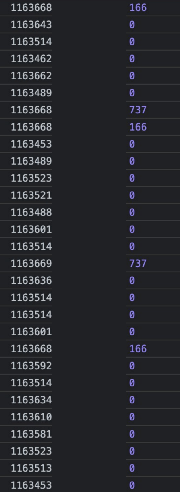
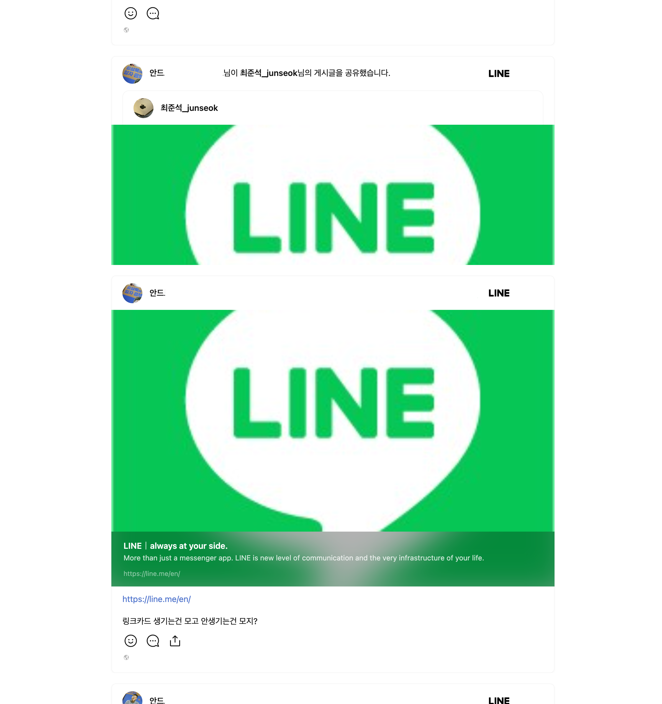
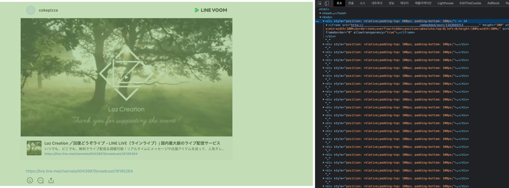

## 서두

평소와 다름없이 맡은 업무... timeline post를 내부 서비스에서 embed하여 사용하고 싶어하는데 (+ 이미 하고있는데) 최대 50개까지 post를 embed할 예정이라고 전달을 받았습니다. 그런데 embed한 post가 접혀서 펼쳐지지 않는다는 이슈가 있다고 하더군요.


> 더 나올것 같지만 잘려있는 화면...

얼마전 8월에 Renewal된 timeline 서비스. 작업을 하면서 `퍼가기`(embed)를 migration하는 일을 했는데, 생각을 해보니 동시에 여러 post를 embed 하면 어떻게 될지에 대해 생각 해보진 않았었습니다.

## 사전 설명

iframe의 height설정을 주거나, style height 값으로 수정이 가능하지만, 설정이 없을 경우, 기본 height는 `150px`입니다. 그리고 timeline의 post들은 각기 height가 다릅니다. 그렇기에 iframe의 height에 대해 한번씩 초기화해주는 작업이 필요합니다.

기존 방식은 timeline의 post에서 [퍼가기]를 눌러 나온 `blockquote태그`와 `script태그(timelineJsSdk.min.js)` 를 유저가 html에 넣으면 timelineJsSdk.min.js가 에서 iframe을 구성하고, blockqutoe 태그와 교체하는 방식입니다.


[퍼가기]를 통해 페이지에 수많은 post를 넣어 timelineJsSdk.min.js는  1개만 가지게 되기 때문에 embed post가 몇개인지 확인하여 iframe을 생성해줘야 합니다. 각 iframe 내부에는 embed.min.js를 각각 가지고 있게 됩니다.

iframe이 로드되면 onload 시점에 iframe 내부의 embed.min.js가 parent에 있는 timelineJsSdk.min.js로 resize postMessage를 요청하게 되고, timelineJsSdk.min.js에서 요청한 post가 어떤 post인지 확인하여 해당 post의 width, height를 변경해주게 됩니다.

## 테스트

우선 로컬에서 테스트 해봅니다. 최대 50개가 들ㅇ...


> 혼돈...

가볍게(?) 30개 정도의 post를 넣었지만 줄줄이 초기화에 실패하고 있었습니다.

기존 코드는 iframe 내부의 window.onload 시점에 500ms라는 버퍼를 두고 postMessage를 보내고 있었습니다. 이 500ms는 컨텐츠가 다 로드되지 않아 iframe 내부 컨텐츠의 height가 완성되지 않았을 것을 염두에 둔 버퍼였습니다.

```js
window.onload = function () {
  setTimeout(() => {
    const embedData = document.getElementById('embed-data');
    console.log(embedData.dataset['id'], embedData.offsetHeight);
    window.parent.postMessage({
      action: 'resize',
      params: {
        height: embedData.offsetHeight,
        width: embedData.offsetWidth,
      },
    }, '*');
  }, 500);
};
```

미리 넣어둔 로그를 확인 해봤습니다. (post의 id 일부는 제거!)



몇몇 postid에 해당하는 값들만 offsetHeight값이 있고 나머지는 0으로 나오고 있습니다. 원인은 [iframe lazy loading](https://web.dev/iframe-lazy-loading/)에 있었습니다.
iframe은 loading이라는 property를 lazy, eager (default) 값으로 설정할 수 있습니다. 하지만, 크롬은 비표준인 auto를 default로 가지고, auto인 경우 브라우저가 정한 방식대로 로드할 수 있도록 합니다.

우선 `loading="eager"` property를 명시적으로 넣어서 테스트 해봤습니다.


화면에 노출되는 상위 n개 정도의 post를 제외하고는 초기화가 되지 않았습니다.
lazy 로딩이 발생하지 않도록 조취를 취했음에도 동일한 문제가 계속 발생하여 다른 방법으로 문제를 해결할 수 밖에 없었습니다.

## 시도 1

기존 setTimeout을 setInterval로 바꾸고, postMessage가 보내졌다면 clearInterval을 해봤습니다.

```js
window.onload = function () {
  const repeatResizing = setInterval(() => {
    const embedData = document.getElementById('embed-data');

    if (embedData) {
      clearInterval(repeatResizing);
      window.parent.postMessage({
        action: 'resize',
        params: {
          height: embedData.offsetHeight,
          width: embedData.offsetWidth,
        },
      }, '*');
    }
  }, 500);
};
```

음... 동작은 하겠지만, interval이 끊임없이 돌고, offsetHeight가 0이어도 초기화 되고 끝나버립니다.
`embedData.offsetHeight > 0` 조건을 추가... 아니 근데 viewport 밖에 있는 embed post의 offsetHeight가 0보다 커지려면 스크롤을 해서 viewport에 들어와야 하는데...? 오호라... 그렇다면 intersectionObserver로 처리하자! 라는 생각이 들었습니다.

## 시도 2

```js
window.onload = function () {
  const observer = new IntersectionObserver(
    function (entries, observer) {
      if (entries[0].isIntersecting) {
        const embedData = document.getElementById('embed-data');
        w.parent.postMessage(
          {
            action: 'resize',
            params: {
              height: embedData.offsetHeight,
              width: embedData.offsetWidth,
            },
          },
          '*'
        );

        observer.disconnect(d);
      }
    },
    {
      root: null,
      rootMargin: '0px',
      threshold: 0.1,
    }
  );

  observer.observe(document.body);
};

```

휴~ 전부 잘 작동합니다. viewport 전체에 조금이라도 들어오면 load되도록 하기 위해 rootMargin은 0px, thrshold는 0.1로 설정하였습니다. 한번 observe하여 insersect 영역에 들어가면 바로 resize 후, disconnect 해버립니다.

하지만, 요구사항은 iframe이 한번에 다 load 되는 것이라는 리뷰를 받았습니다. (누가 스크롤을 할때마다 끊키면서 뜨는 iframe의 동작을 기대할까요...ㅠㅠ) 하지만 `loading="eager"` property가 제대로 동작하지 않는 상태에서 유저의 viewport가 들어와 iframe의 offsetHeight가 늘어날때까지 계속 setInterval을 대기할수도 없는 노릇이었습니다. (최대 50개의 iframe에 interval이 200ms정도마다 돌아가게 된다...)

결국 하기로 한 방법은 setInterval과 intersection observer를 병렬적으로 사용하기로 하였고, interval은 10s 후 강제로 종료 시키기로 하였습니다.

## 시도 3

intersection observer나 setInterval에서 초기 resize가 실행되면, 다른 한쪽도 종료시켜줘야 합니다.

```js
let isResizedEmbedPost = false;

const _resizingMessage = function (w, d) {
  const embedData = d.getElementById('embed-data'); // Excluding other function dependencies
  w.parent.postMessage(
    {
      action: 'resize',
      params: {
        height: embedData.offsetHeight,
        width: embedData.offsetWidth,
      },
    },
    '*'
  );
};

const initResizingObserver = function (w, d) {
  const observerInstance = new IntersectionObserver(
    function (entries, observer) {
      if (entries[0].isIntersecting) {
        if (isResizedEmbedPost) { // interval에서 초기화 되었음
          observerInstance.disconnect(d);
        }

        isResizedEmbedPost = true; // observer 초기화
        _resizingMessage(w, d);
        observerInstance.disconnect(d);
      }
    },
    {
      root: null,
      rootMargin: '0px',
      threshold: 1,
    }
  );

  observerInstance.observe(d.body);
};

const initResizingMessage = function (w, d) {
  const repeatResizing = setInterval(() => {
    const embedData = d.getElementById('embed-data');

    if (isResizedEmbedPost) { // observer에서 초기화 되었음
      clearInterval(repeatResizing);
      clearTimeout(forcedClearFlag);
    } else if (embedData && embedData.offsetHeight > 0) { // interval 초기화
      isResizedEmbedPost = true;
      _resizingMessage(w, d);
      clearInterval(repeatResizing);
      clearTimeout(forcedClearFlag);
    }
  }, 200);

  const forcedClearFlag = setTimeout(function () { // 10초뒤에 강제로 interval 종료
    clearInterval(repeatResizing);
  }, 10000);
};

window.onload = function () {
  initResizingMessage(window, document);
  initResizingObserver(window, document);
}
```

완료...! 다 되었습니다. 자~ 마지막으로 테스트를 해보겠습니다.



으어어 ㅠㅠ...

확인을 해보니 link preview가 제대로 생성이 되지 않았습니다 ㅠㅠ... 타이밍 이슈가 존재하네요.

interval에서는 (browser에서 viewport를 어떻게 설정하는 지는 모르겠지만)200ms의 버퍼가 있어서 괜찮았고, observer에서만 발생하는 이슈였습니다. 따라서 동일한 200ms을 setTimeout으로 걸어주고, threshold 값을 테스트 해봤습니다.

```js
...
const initResizingObserver = function (w, d) {
  const observerInstance = new IntersectionObserver(
    function (entries, observer) {
      if (entries[0].isIntersecting) {
        if (isResizedEmbedPost) { // interval에서 초기화 되었음
          observerInstance.disconnect(d);
        }

        isResizedEmbedPost = true; // observer 초기화

        setTimeout(() => { // 200ms 추가
          _resizingMessage(w, d);
        }, 200);

        observerInstance.disconnect(d);
      }
    },
    {
      root: null, // null이면 window
      rootMargin: '0px',
      threshold: 0.3, // 영역의 30%가 viewport에 노출되면 isIntersecting
    }
  );

  observerInstance.observe(d.body);
};
...
```

이렇게 힘들게 이슈를 해결했는데, 고민을 좀 해봅니다... youtube 같은 iframe embed 컨텐츠는 항상 잘 나왔는데... 어떤 방식이려나...

검색을 하다 [간단한 css를 다루는 페이지](https://erim1005.tistory.com/entry/Youtube-iframe-width-100-height-auto)를 찾았고, 그대로 해봅니다.




iframe에 height 속성을 주지 않고 div로 감싸 padding으로 조절하는 방법이었습니다. 결국 이렇게 하면 동적인 iframe의 height에 대응할 순 없을 것 같습니다.

## ?!

기존에 테스트하던 local domain 대신 beta에 배포 후 beta production 도메인으로 주소를 바꾸고 테스트를 했더니 정상적으로 한번에 load가 됩니다.

수정한 버전이 배포된 timeline의 beta production 의 도메인으로 넣으니 기존 테스트 시에 넣었던 변조된 localhost와는 다르게, `loading="eager"` property 없이 20~30개 페이지의 로딩이 정적으로 잘 실행 되네요.

이 부분에 대해서는 추가적으로 확인이 필요해 보입니다. (http 프로토콜 or nextjs의 처리가 아닐까 의심이 됩니다)