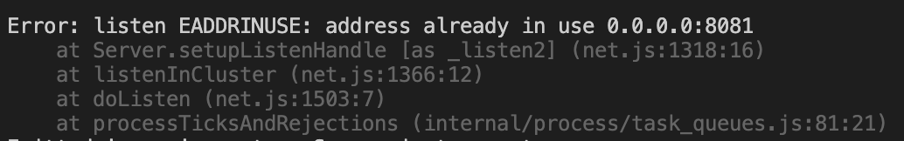

가끔 vscode코드로 개발을 하다 보면 vscode 프로세스를 죽였는데도 vscode 내의 터미널에서 돌리던 node server가 죽지 않은 것인지, 특정 port가 계속 연결되어 있을 때가 있습니다.
osx를 사용하면서 linux와 명령어가 살짝 달라서 port를 찾는 명령어가 간단치 않습니다. 자주 발생하는 것도 아니고... 이를 위해 기록용으로 남겨둡니다.

---



보통 위와 같은 메세지로 에러가 많이 발생하죠.

port가 열려있다면 아래와 같은 명령어로 메세지가 출력되게 됩니다.

리눅스에서는 아래 명령어로 한번에 port번호를 확인 가능합니다.
(-a 옵션이 port를 노출시켜주는 옵션이지만, unix 환경에선 사용이 불가능 하네요.)

```sh
$ netstat -naep | grep {port_number}
# 결과 > tcp    0   0.0.0.0:{port_number}   0.0.0.0:*   LISTEN  500 561124  {pid}/sso_engined
```

unix(보통 mac 환경)에서는

```sh
$ netstat -naA | grep {port_number}
# 결과 > 114d11a7e2501fwe        0 tcp4       0      0  *.{port_number}  
```


위 결과값으로 나온 소켓번호를 lsof `(list open files. 시스템에 열려있는 파일 정보를 출력)` 명령어로 검색해줍니다.

```sh
$ lsof | grep 114d11a7f33c5fad
# 결과 > node      {pid} user  141u     IPv6 0x114d11a7f33c5fad        0t0                 TCP *:us-srv (LISTEN)
```

결과로 나온 node의 instance를 죽여주면 됩니다.

```sh
$ kill -9 {pid}
```
