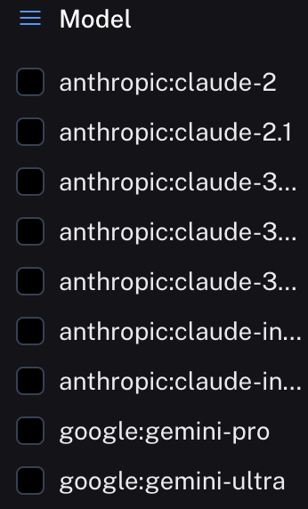
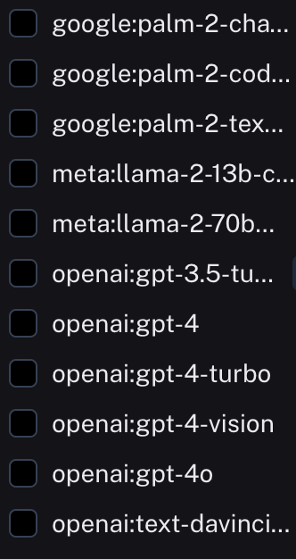
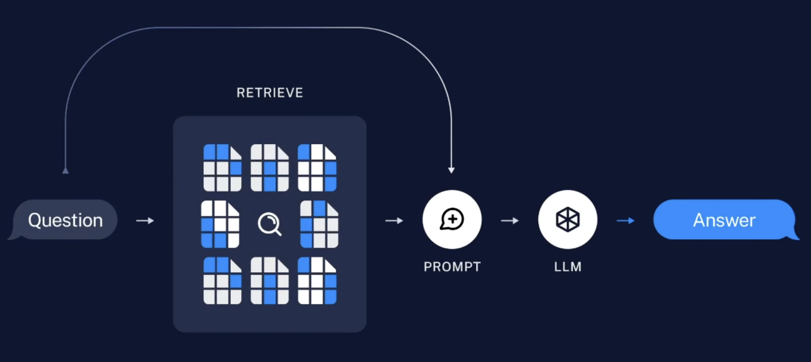

- LangChain은 프레임워크
    - LLM (Large Language Model)으로 서비스를 만들 수 있게 도와줌
    
    

### LLM

- 우리가 아는 chatGPT도 LLM 중 하나
- chatGPT처럼 대화형 AI 서비스에서 이용하는게 LLM인가?
    - 그건 chatGPT를 이용해 OpenAI에서 범용적 사용을 위해 서비스를 만들어 놓은 것
    - chatGPT의 LLM 모델만 사용할수도 있음
- https://smith.langchain.com/hub
    - LangChain hub 사이트에서 모델이 얼마나 있는지 확인할 수 있음
    - 해당 모델들은 알만한 회사들의 모델들
    - 보통 뼈대가 되는 모델들도 위에 있는 모델들이 유명한 모델이긴 해도 다른 모델들이 많음

### PROMPT Engineering

- 말 그대로 어떻게 더 효과적으로 LLM에게 질문을 할지에 대한 내용
- 원하는 AI 모델링 결과를 얻기위해 입력하는 모든것
    - 사전에 학습시키는 데이터
    - 상황마다 다른 유저의 입력
    - 모델을 조정하는 외부 정보
    - ...
- chatGPT3.5는 2021년 이전 데이터들을 학습했다고 한다. 그래서 날짜와 상관있는데 데이터에 대한 질문을 하면 (ex - `2024년 남자 테니스 랭킹 1위는 누구야?`) 이상한 답변을 진짜인것 마냥 답해줌
    - 이를 `할루시네이션` 이라고 함
    - 정확히는 정보가 없더라도 엉뚱한 대답 or 거짓으로 말을 이어나가는 현상
    - 이런 현상을 줄여나갈 수 있도록 노력해야 함

### Chain

- LLM 사슬을 형성하여 연속 LLM 호출이 가능하도록 해줌
  - (A 질문 => A 답변 => B 질문 => A 답변과 섞어서 B에 대한 답변...)
- 아래 설명할 RAG단계에서 store 이후 결과가 chain으로 넘어감

### ReAct

- Reason & Action. 추론과 행동
- ReAct는 LLM과 결합하여 사용하는 일반적인 패러다임
- 따라서 LLM은 질문에 대해 결과를 추론하고 결과를 얻기위해 행동함
- LLM의 프롬프팅 및 결과를 처리하는 방법 중 하나 (반드시 필요하진 않다는 뜻)
- 모델 뿐 아니라 실제 세상의 정보들을 예측하는 용도로도 사용됨
- 시스템은 행동에 대한 계획을 생성, 유지 및 조정하는 동시에 외부 환경(예: Wikipedia)과의 상호 작용을 통해 추론에 추가 정보를 통합
    - 이러한 외부환경을 Agent와 Tool을 통해 제공
- ReAct의 예와 질문 답변을 수행하는데 필요한 도구의 예시

  - Template을 통해 Thought, Act, Obs가 반복됨을 볼 수 있음
    - 이러한 Template 형태로 보아 ReAct겠구나~ 에상 가능
  - Search (아마 Goolge Search로 예상) Tool이 실행되고 있음을 알 수 있음

### LLM과 Agent

- LLM - 학습된 데이터를 `읽어서` 유저의 query 결과를 도출
- Agent - 학습된 데이터와 유저가 추가한 데이터를 섞어서 query의 결과를 도출
    - 기본적인 template 만으로 수행할 수 없는 작업을 해줌
    - 데이터를 `읽고 쓸 수` 있음
    - 또한 이 결과를 바탕으로 제공된 `Tool` 목록에서 원하는 Tool을 골라 결과 도출에 사용함
    - ex) 챗봇 - 고객의 정보와 유저가 필요한 정보(유저의 질문 query)를 조합해 결과를 도출
    - ex) 웹검색을 해주는 툴, sql 쿼리를 작성해 정보를 제공해주는 툴 등등이 있음

### Memory

- 기본적으로 LLM 모델이 대화하는 내용들을 저장까지 하진 않음
    - 보통 chatGPT 모델을 쓰다보니 잊고있음. chatGPT는 자체적으로 Memorize 기능 지원
- 이는 채팅 이력을 기억하고 이를 기반으로 대화형 명령을 할 수 있도록 도와줌

### RAG

- https://www.youtube.com/watch?v=NfQrRQmDrcc
- 검색 / 증강 / 생성
- 검색 결과로 답변을 얻는 작업
- chatGPT 모델이 아닌 서비스가 RAG의 한 종류, 서비스라 보면 됨

1. 전처리 (4개를 다 합하여 index 라고 부름)

    - 아래 4개의 프로세스가 LLM을 통한 서비스를 만들 때 기본적으로 사전에 이루어져야 하는 작업들
    ```
    1. LOAD
        - 파일들을 로드함
        - 여기서 파일은 유저의 입력 텍스트, text파일, json 파일, pdf 파일등등…
    2. SPLIT
        - 한번에 읽어들일 수 있는 토큰 수가 있기 때문에 파일을 모두 쪼개야 함. chunk파일로 분할
    3. EMBED
        - 이 파일들을 AI가 읽을 수 있도록 값으로 변환해주는 작업. 이 과정에 LLM 모델이 사용됨.
    4. STORE
        - vector db에 저장
    ```

2. 서비스

```
- Question
    - 유저가 질문을 함
- RETRIEVE
    - embed에서 질문을 바탕으로 필요한 내용을 발췌
- PROMPT
    - 발췌된 내용과 PROMPT에 정의된 내용을 바탕으로 LLM에 질의할 내용을 만듬
- LLM
    - 만들어진 질의 내용을 가지고 LLM조회를 하여 답변을 해줌
```


- 전처리 단계 조합
    - LOAD(150여 가지) -> SPLIT(10여 가지) -> EMBED(60여 가지) -> STORE(80여 가지) -> 360,000,000 경우의 수 조합이 가능함
        - 문서를 LOAD하는 전략이 150여 가지 (text, json, pdf 등등…)
        - text SPLIT하는 전략이 10여가지
        - 문서를 EMBED하는 전략(모델)이 60여가지 (기본 60여 가지지만, https://huggingface.co/ 를 보면 이 전략이 엄청나게 많음…)
        - EMBED된 문서를 Vector Store에 저장할 때의 Vector DB의 종류가 80여 가지
        - Vector DB를 조회하기 위한 RETRIEVE 단계의 Vector DB 검색기 종류가 50여 가지
    - 위에 기본 가지수는 랭체인 사용시 기본적으로 사용 가능한 개수들
    - 이렇게 많은 경우의 수가 있다…? => 결론은 다 테스트 해볼 순 없다!
    - 상황에 맞는 적절한 조합을 찾는게 중요하다.
- LOAD (PDF 기준)
    - 선택시 고려 사항
        - 텍스트를 원형 그대로 잘 가져오는지
            - 한글 인코딩
            - 특수문자, 수식
        - 메타데이터 종류
            - 본문 뿐만 아니라 페이지 번호, 차트, 좌표, 속성값 등등 모두 잘 가져오는지
            - 부가 메타데이터 속성들
        - 문서를 읽는 속도
    - 종류
        - fitz
        - PyPDFLoader
        - UnstructuredPDFLoader
        - PDFPlumnber
        - …
- SPLIT (Text Splitter)
    - 문서를 특정 기준으로 분할(chunk)할 때 활용
    - 종류
        - CharacterTextSplitter
        - RecursiveCharacterTextSplitter
        - TokenTextSplitter
        - HuggingFace
        - SemanticChunker (experimental)
- EMBED
    - EMBED 이후 Vector Store에 저장해야 하는데, 저장 후 Semantic Search (의미 검색)과 같은 작업을 수행할 때 유용하게 사용할 수 있음.
    - 이 기능을 잘 활용하기 위해 잘 맞는 모델을 선택하는게 중요.
    - 또한 한국어도 가능하게 해야 하므로!! (optional)
    - 랭체인의 EMBED 클래스는 두가지 메서드 존재
        - 문서를 import해서 DB에 넣을 때의 embed
        - 유저가 질문을 query 할때의 embed
        - 결국 위 2가지 embed된 내용의 유사성을 조사하는 것
    - 가끔 위 두가지 메서드의 모델이 다른 경우가 있음. 그럼 유사성을 조사할 때 유사도가 떨어질 수 있으니 주의.
    - 종류
        - OpenAIEmbedding
            - 보통은 이걸 사용. 무난. 사용성 좋음. 한글처리 좋음.
            - 다른 embedding 모델과 다르게 로컬에 저장해서 gpu를 쓰지 않음. (Api 형식)
            - 과금 압박이 생길 수 있음
        - CacheBackedEmbeddings
            - 임베딩을 저장하거나 캐시해서 다시 계산할 필요가 없도록 해줌 (key-value)
            - 텍스트는 해시되서 캐시키로 사용
            - 캐시된 embedding 벡터 가져오는건 거의 0초에 수렴. 매우 빠름
            - 여러 모델을 사용하는 경우, namespace를 설정해서 캐시 가능
            - ex1) openAiEmbedding으로 동일 문서를 10명이 조회한 경우 or 1명이 10번 조회한 경우 => 10번의 비용 발생
            - ex2) openAiEmbedding + CacheBackedEmbeddings으로 같은 문서를 10, 100번 조회 => 캐시를 위한 1번의 비용만 발생
        - hugging face에서 벤치마크 점수만 믿으면 안됨. 우리는 한글도 처리해야 하니까…!
- Vector Store
    - 확장성 있게 -> 클라우드 / 여러 사람이 자주, 빈번하게 조회 -> 로컬
    - 모델에 따라 고유 특성이 있고, 방대한 데이터 입/출에 대한 관리가 필요
    - 인기 있는 Vector DB
        - 클라우드
            - PineCone
            - Weaviate
            - ElasticSearch
        - 로컬
            - Chroma
            - FAISS (meta) => 캐글 1등 팀이 썼었음