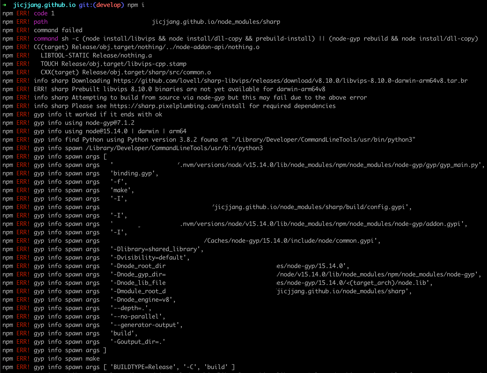
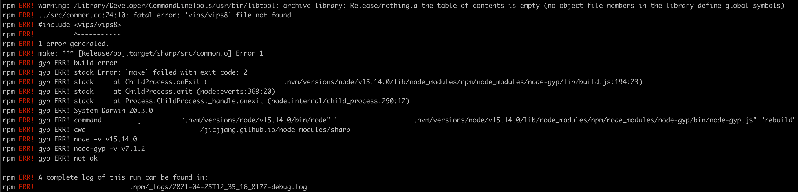
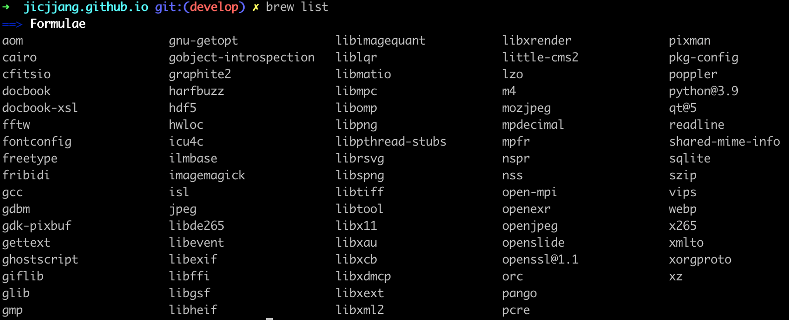

봇 관련된 사이드 프로젝트를 진행한 뒤, 완성된 프로젝트를 어떻게 serving할 지 고민하다 맥 미니를 사는 것으로 결정했습니다 ㅎㅎ

결정 후 바로 m1 chip cpu의 맥 미니를 구매하였고, 프로젝트 세팅을 마무리 했습니다. (잘 돌아간다 🥳🥳🥳)

이후 블로그에 사이드 프로젝트 후기를 남기려고 `git clone`후 `npm install`을 하는데...

여러 pc에서 (회사, 개인 노트북) 잘 동작하면 프로젝트가 갑자기 에러를 내뱉으니 당황스러웠습니다.

가장 처음 나온 에러의 내용인 `ERR! sharp Prebuilt libvips 8.10.0 binaries are not yet available for darwin-arm64v8` 이 부분을 보고 `sharp` 라는 라이브러리 (직접 사용하는게 아닌 깊은 dept에 있는 코어한 라이브러리)를 위주로 찾아봤습니다.

역시 [저와 같은 이슈](https://github.com/lovell/sharp/issues/2460)를 겪은 사람은 한둘이 아니었고, 해당 내용에 대해 많은 논의가 있었습니다.

sharp 라이브러리 documentation에서도 [Apple m1](https://sharp.pixelplumbing.com/install#apple-m1)에 대한 내용이 있었으나, 큰 도움이 되진 않았습니다..

---

결국 해결한 방법은 [해당 댓글](https://github.com/lovell/sharp/issues/2460#issuecomment-751491241) 을 보고 진행한 `brew install vips` 명령어 였습니다.
(위 댓글의 `vips`가 아닌 `libvips` 패키지를 설치해도 된다는 댓글이 있었으나, 이미 `vips`로 설치를 진행했습니다.)

해당 명령어로 아래의 모든 패키지가 설치되었습니다 (...)

---

해결하기에 심각한 공수가 들어간 것은 아니었지만, cpu의 변화로 영향을 받는 패키지가 있다는 것을 알게 되었고, (sharp는 이미지 processing 관련 library) 항상 비슷한 osx환경을 사용하며 뭔가... 무뎌진? 새로운 기술에 대한 경각심을 깨달을 수 있었습니다.