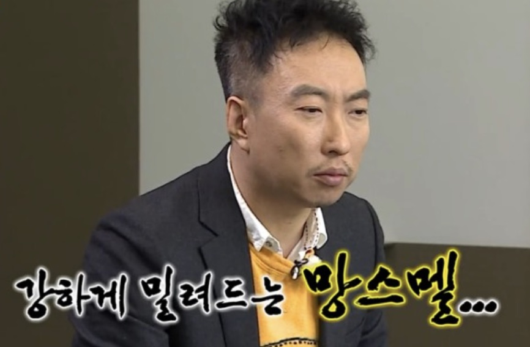
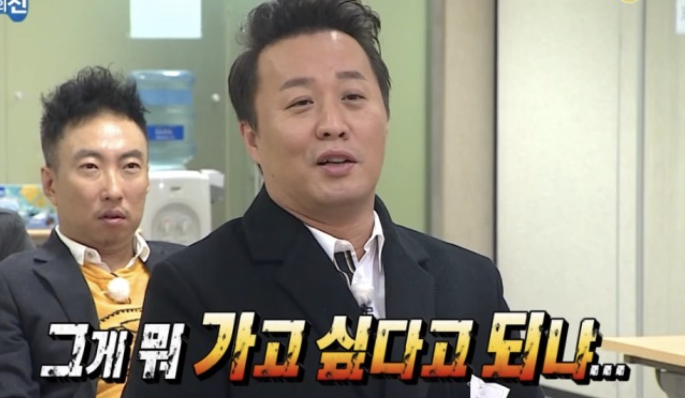
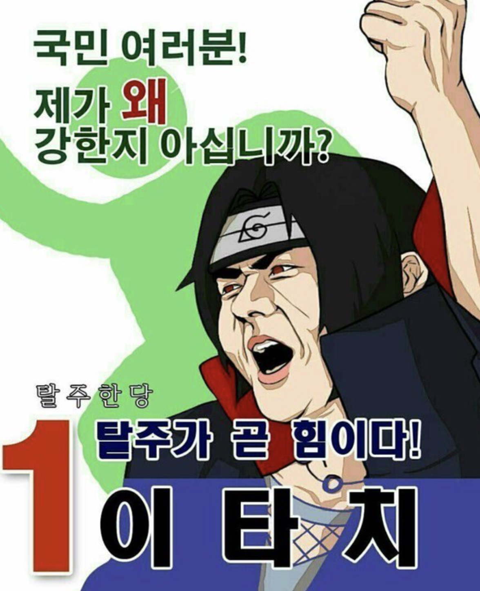

이 포스팅은 존칭이 없습니다 :)

---

항상 반복되는 말인 것 같은데, 연차가 얼마 되지도 않는데 벌써 4번째 회사다.
특히나 이번 이직은 약간의 충동적인 도전이기도 했다. (후에 서술해보겠다.)
이 때문에 면접때마다 단골로 듣게되는 질문이 있다.

`이직 사유가 어떻게 됩니까?`, `왜 이렇게 자주 이직했죠?`, `본인에게 문제가 없다고 생각합니까?`

연차가 쌓이면서, 이직을 자주하면서, 많은 회사를 거치고 수많은 회사의 면접을 거치며 점점 여유로워지는 것을 느낀다.
하지만 이런 항상 나올걸 알고있는 질문은 준비를 하더라도 많이 당황하고 고민하게 되는 것 같다.

과연 이 회사는 내가 솔직한 것을 원할까? 아니면 듣기 좋은 말을 듣고싶어 할까?

...

## 이직 사유가 어떻게 됩니까?

라인으로 옮길때 썼던 이직기를 다시 한번 훑었다.
카카오페이에서 라인으로 이직을 할 때, 팀원 20명 중 15명이 퇴사하거나 팀을 옮기는 엄청난 이벤트가 있었다.
(정말 아직도 충격적이고 생생하게 떠오른다.)

퇴사할 당시 가지고 있었던 수많은 스톡옵션이 지금은 눈앞에 아른거리지만 그 당시만 해도 상장은 이제 곧 할꺼다, 이제 곧 할꺼다 말만 반복하는 상황이었다.
지금와선 일년만 버텨볼껄 싶지만 아마 그 당시로 돌아가도 내 결정이 크게 바뀌진 않았을 것 같다.

얘기가 옆으로 샜다.

다시 돌아가보자. 면접을 볼 때 이런 상황을 듣고싶어할까, 아니면 `더 좋은 팀원들과 더 재밌는 프로젝트를 겪으며 성장하기 위해 이직하려고 합니다 :D` 와 같은
듣기 좋은 말을 듣고싶은 것일까?

면접 결과가 그 답을 보여주는것이 아닐까 싶다. 이번 합격 타율은 40% 정도.
그중 위와 같은 사유를(과거의 사유. 현재 이직하려는 사유는 아님) 솔직하게 말한 곳이 있고, 아닌 곳이 있다.

솔직히 말해 합격한 비율이 듣기 좋게 말한 합격 비율보다 절반정도 될 것 같다.

++ 물론 기술적으로 핏이 안맞았던 곳도 있을 것이다. 하지만 이번 이직을 하며 진행했던 면접들은 모두 스크립트를 작성했고,
복기했을 때 실수나 답을 못한 질문이 2개가 넘어가는 회사는 없었다.

++ 모든 회사는 최소 한시간 반의 면접을 진행했다. 어떻게 1시간 면접이 하나도 없었지...?

회사에 맞는 핏이라는게 분명 있다는 것을 안다. 넘지말아야 하는 선이 있다는 것도 안다. 하지만 나는 분명 그 선을 자주 넘나드는 사람이다.
내가 잘못한게 아닌데 솔직한게 문제가 될까? 이게 선을 넘는 것인가?

자유로운 IT 기업에서도 이는 분명 문제가 되는 것이었다. 왜 책임은 우리가 져야하지.

...

## 왜 이렇게 자주 이직했죠?

모든 이직이 충동적이진 않다. 나름의 이유가 있다.
벅스때는 JVM 3.6이었던가... (이젠 기억이 가물가물하다) spring boot도 써보고 싶었고, scope chaining(아마 3.8때 도입이었던가... 로 기억한다)도 한번 써보고 싶었다.
하지만 번번히 무산되었다. 원래 프론트엔드를 희망하다 해당 직군이 없어 풀스택 개발을 하였고, 마이크로 서비스화를 위해 프론트엔드에 대해 세미나를 몇번을 진행했던가...
3~5번정도의 팀 세미나를 진행하고 겨우 회사의 IR/HR 관련 정보를 보여주는 홈페이지에 대한 개편을 할당받았다. 그마저도
`너 할수 있으니까 다른분이 프론트 개발하고, 넌 서버 설정같은걸 담당해` 라는 말을 들었다. 이걸 계기로 이직을 준비하였다. 신입이 개발하기에 적합한 환경이 아니라 판단했기 때문이다.

카카오페이때는 생략하겠다. 하지만 팀원들과 서비스, 회사의 지원등은 정말 좋았다. `팀원이 곧 복지다` 라는 말은 정말 이 회사에서 실감했다.

++ 물론 한편으론 독이 됐지만...

이번 라인에서의 이직은 벅스때와 유사했다. 벅스때는 신규스펙이라도 많고, 이벤트 페이지를 무수히 많이 개발하였지만 1년 9개월동안 한가지 서비스를 유지보수만 하고,
디자인 개편만 계속 진행하였다. 약간의 현타와 함께 이직을 준비하게 되었고, 새로운 뭔가를 여러 방면으로 도전해보고 싶었다.

이러한 사유들이 누군가에겐 꾸준하지 못하다 들을 수 있겠지만, 나에겐 나름의 정당한 이유가 되었다고 생각한다.
내 성장 내가 챙겨야지 누구에게 맡기겠는가.

...

## 본인에게 문제가 없다고 생각합니까?

뭐... 내가 문제없는 사람이라는건 아니다. 나도 분명 문제있는 사람이겠지.
하지만 적어도 지금까지 나 때문에 팀이 망가지거나, 서비스가 망가지는 ([루나처럼...](https://www.hani.co.kr/arti/economy/finance/1042864.html))일은 없었다.
잘났다기 보단 조직에 융화되어 잘 지냈고, 적어도 이번 이직도 날 추천해준 사람이 있었으며 (아쉽게도 추천인이 합격 후 입사전에 날 추천해줘서 추천비는 꿈도 못꾸고 날아갔다... 아쉽다 ㅠㅠ)
이직 후 출근 시 날 반겨줬던 사람이 있었으니 그저 골치덩어린 아닐 것이다.

...

---

이제 주니어라는 허물은 조금 벗고있는 때인 것 같다. 혼자서 뭔가 뚱땅뚱땅 만들긴 하지만, 시스템과 전체적인 설계까지는 깔끔하지 못한??
위와 같은 내 생각이 아직 철저히 논리적으로 맞는 것 같지도 않다. 그저 내 생각일 뿐. (반박시 님말이 맞다는 유행어를 나도 한번 써본다.)

그래도 모든 판단은 내가 옳다고 내린 판단이니 결과에 대한 책임도 내가 지는 것이고, 점점 면접에서 떨어질때의 충격도 약해진다.
뭐 그냥 핏이 안맞았던거지 뭐... 아쉽게도 합격했을 때의 기쁨 또한 첫 회사를 합격하고, 이직했을 때보다 줄어든다.

어찌됐건 이직이란건 더 좋은 환경을 찾아 떠나는건데 그 준비로 한층 더 성장할 수 있지만, 헛헛한 마음은 더 커지는 것 같다.

++ 학년이 올라가고 중학교에서 고등학교, 고등학교에서 대학으로 떠나는 마음...?

당장은 아쉬움 한가득인 상황이지만 또 적응하고 어느새 서비스 오픈한다고 알릴 수 있었으면 좋겠다.
