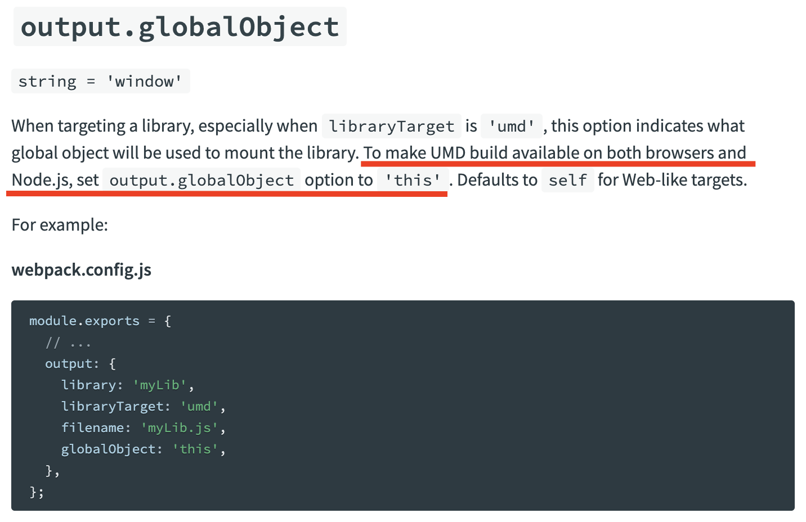

현재 회사의 리뉴얼 중인 서비스의 성능 개선, 그 중 dynamic import를 진행하면서 겪게된 이슈들에 대해 공유해보고자 합니다.

### 1. Error: cannot update a component ('...') while rendering a different component ('...')

서비스를 개발하면서 사내에서 범용적으로 사용할 React 라이브러리를 동시에 제작하면서 해당 라이브러리를 npm package file path로 import하여 테스트, production에서는 build하여 publish한 뒤, 해당 버전을 넣는 방식으로 개발중 입니다.

해당 라이브러리의 Code splitting을 진행하고 splited code에 대해 프로젝트에서 dynamic import
([next.js의 dynamic 기능](https://nextjs.org/docs/advanced-features/dynamic-import))을 활용하여 해당 모듈을 import하였는데

`Error: cannot update a component ('...') while rendering a different component ('...')`

이러한 에러가 발생하였습니다.

기존에 SSR을 위해 해당 모듈 내에서 아래와 같이 코드를 사용하고 있었습니다.

```tsx
...
const AComponent = () => {
  ...
  dispatch({
    type: 'editor_blahblah',
    ...
  })
  ...
}
...
```

SSR 시점에 들어오자마자 데이터를 바로 fetch하기 위함이었습니다. (물론 지속적인 re-render를 피하기 위한 리팩토링은 필요합니다 ^^;) 하지만 dynamic import를 하게 되면서 컴포넌트의 property가 최초 렌더링 이전에 업데이트 되는 것으로 생기는 이슈인가...? 생각했습니다.

[해당 이슈](https://reactjs.org/blog/2020/02/26/react-v16.13.0.html#warnings-for-some-updates-during-render)에 대해 확인해보니, `render되는 동안의 상태를 업데이트시키는 동작은 같은 component 내의 state에 대해서만 허용한다.` 라는 내용이 있었습니다.

해결책은 간단했습니다. 

```tsx
...
const AComponent = () => {
  ...
  useEffect(() => {
    dispatch({
      type: 'editor_blahblah',
      ...
    })
  }, [...]);
  ...
}
...
```

dynamic import를 useEffect로 감싸주기만 하면 됐습니다. render가 일어난 뒤, mount 시점에 dispatch 할테니까요.

> [참고](https://stackoverflow.com/questions/62336340/cannot-update-a-component-while-rendering-a-different-component-warning)

---

### 2. ReferenceError: self is undefined

라이브러리의 Code splitting을 마치고 기존과 동일하게 빌드 후, 프로젝트에서 dynamic import를 하니 `ReferenceError: self is undefined` 에러가 발생하였습니다.

Code splitting과 영향이 있을까 조금 의심이 되긴했지만, dynamic import로 생기는 이슈일거란 의심이 훨씬 컸습니다.

구글링으로 발견한 [포스트](https://stackoverflow.com/questions/66096260/webpack-why-am-i-getting-referenceerror-self-is-not-defined-in-next-js-when-i)에서 도움이 된다는 내용을 발견하였습니다.


webpack에서 [globalObject](https://webpack.js.org/configuration/output/#outputglobalobject) 라는 옵션을 알게 되었고 이를 확인했습니다.



universal한 환경에서 라이브러리를 동일한 libraryTarget 옵션으로 사용하려면 `globalObject: 'this'` 옵션을 넣으라는 것이었습니다.

음... static import에선 발생하지 안다가 dynamic import에서만...? static import에서는 사용하는 library 자체가 같은 chunk 내에 포함되어버리기 때문에 해당 설정이 없어도 상관이 없었을 것입니다. 하지만 별도의 chunk가 되면서 같은 설정을 들고가지 못하게 되었기 때문에 this가 의미없는 global한 값을 들고있지 않았을까 합니다.

---

위 이슈들 말고도 static import시엔 타입이 강하게 엮이지 않아(아직 원인은 찾지 못함...) required하도록 설정해놓은 property값을 넣어주지 않아도 사용이 가능했었는데, dynamic import를 하게 되면서 아래와 같이 타입을 주입해주니 연결이 아주 잘 되어(...) 기존에 발생하지 않던 에러가 줄줄줄 나오는 이슈도 있었고,

라이브러리 내에서 위에 기재한 1번처럼 dispatch를 ssr시점에 할 때 render 이전부터 있던 데이터가 mount 시점 이후로 넘어가니 undefined 에러가 활활활...

성능 개선은 참 어려운 일인 것 같습니다만, 끝났을 때 향상된 TTFB, FCP를 보면 뿌듯합니다. ssr 이었기 때문에 Code splitting만으로 엄청난 성능 향상을 보이진 않았지만 light house에서 보여주는 `Redux unused javascript` 요소의 퍼센티지를 줄이는덴 큰 역할을 한 것 같습니다.

