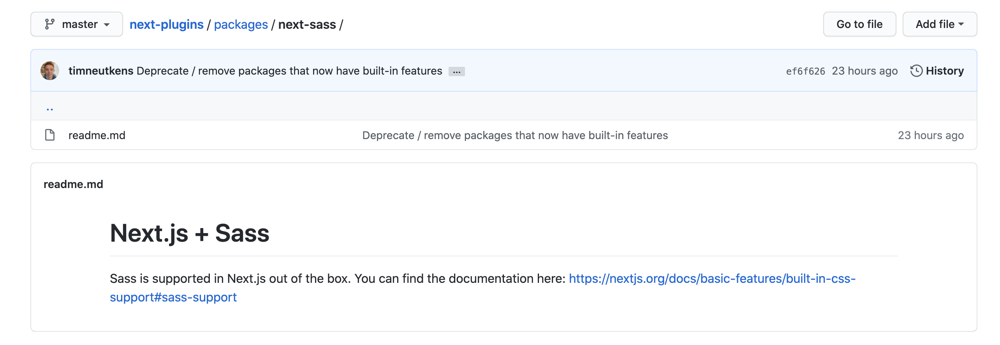

Next.js를 최근 사용해보기 시작하며 PoC를 많이 작성하고 있는데, 여러 이슈를 만나보고 있습니다.
Next.js에서 Custom webpack 설정 시, 갑작스럽게 생긴 이슈에 대해 공유하고자 합니다.

---

기본적으로 Next.js에서는 [`@zeit/next-sass`](https://github.com/vercel/next-plugins/tree/master/packages/next-sass), [`@zeit/next-css`](https://github.com/vercel/next-plugins/tree/master/packages/next-css) 라이브러리를 지원해줘서 이를 사용하면 되었고,
이를 활용해 프로젝트도 해본 경험이 있었기 때문에 큰 무리 없을 것이라 예상했습니다.

지난 주 금요일, Renewal 프로젝트가 시작되었고 사내 퍼블리셔 분들이 요청한 style 관련 설정을 하고있었는데요,
Next.js에서 `@zeit/next-sass`, `@zeit/next-css` 라이브러리의 readme를 보러 들어갔는데 패키지가 사라져 있었습니다.



Next.js sass는 3월에 발표한 [9.3 버전 업데이트 로그](https://nextjs.org/blog/next-9-3#built-in-sass-support-for-global-stylesheets)에 기재되며 built-in 되었다는 기록은 있으나, deprecated에 대한 공지는 따로 없었습니다. (Next.js github에는 반영되었으나, release가 되지 않음)
built-in을 사용하면 되지, 뭐가 문제냐? 바로 webpack 설정 시 `style-loader`, `css-loader` module.rules의 options를 설정할 수 없기 때문입니다.
유저들의 요청으로 `sassOptions` field는 생겼으나, 아직 두 loader의 options는 존재하지 않았습니다.

- built-in 에서 [sassOptions의 설명](https://nextjs.org/blog/next-9-4#configurable-sass-support)은 `user들의 요청으로 sass comile 옵션을 넣었다`
- `cssOptions`, `styleOptions에` 대한 내용은 없음. (discussions에 있으나, 꽤 오랜기간 업데이트가 없었습니다. [(링크)](https://github.com/vercel/next.js/discussions/15818))

```javascript
// next.config.js
const path = require('path')

module.exports = {
  sassOptions: {
    includePaths: [path.join(__dirname, 'styles')]
  }
}
```

사전에 공지가 있었는진 확인을 못했지만 갑작스레 사용하려던 라이브러리가 하루아침에(...) deprecated가 되어있었고, npm package 에서도 없어지진 않았지만 금방 사라질 라이브러리를 사용할 순 없다고 판단해 대체 방안을 찾아볼 수 밖에 없었습니다.

## 1. 그래도 일단 @zeit/next-sass, @zeit/next-css를 사용하자

위 라이브러리들을 사용한다면 기존 `@zeit/next-sass` 사용법처럼 sass, css options를 모두 넣을 수 있었습니다.

### <before>
```javascript
// next.config.js
const withSass = require('@zeit/next-sass')
module.exports = withSass({
  cssModules: true,
  cssLoaderOptions: {
    importLoaders: 1,
    localIdentName: "[local]___[hash:base64:5]",
  }
})
```

하지만 Renewal 중인 프로젝트의 중요 프레임워크 bundling 라이브러리 중 하나가 근 시일 내에 없어질 수 있다는 리스크는 간과할 수 없었습니다.

## 2. 내장된 Sass옵션을 사용하자

React의 SSR 프레임워크인 Next.js에서 Loader들을 설정 할 때, 기본적으로 sass, postcss가 기본적으로 built-in 되도록 설정되어있습니다. (*.scss는 _app.tsx에서만, 일반 파일에서 스타일을 사용하려면 *.module.scss로만 사용 가능 / sass npm module만 설치하면 됨)

해당 케이스는 `css-loader, style-loader의 설정하지 못하는 문제를 일단 안고 가자` 입니다.
- postcss-loader의 설정 부분인 postcss.config.js는 커스텀이 가능하여 내부에 플러그인 추가 가능 / autoprefixer는 자동 내장
- 위 옵션들에 대한 커스텀만 불가능하고, 동작들은 잘 됨

## 3. 직접 Loader를 설정하자

물론 해당 옵션을 무시하고 직접 설치도 가능합니다.

```javascript
// next.config.js
...
config.module.rules.push({
  test: /\.s[ac]ss$/i,
  use: [
    isDevelopment ? 'isomorphic-style-loader' : MiniCssExtractPlugin.loader, // Creates `style` nodes from JS strings
    // ssr에선 일반적인 style-loader가 사용 불가 => isomorphic-style-loader를 사용
    // 동일 기능 라이브러리 중 가장 사용률이 높음 https://www.npmtrends.com/hypernova-vs-isomorphic-style-loader-vs-universal-webpack-vs-webpack-isomorphic-tools
    // MiniCssExtractPlugin은 기존 next.js optimization에 있는 CssMinimizerPlugin과 함께 사용 가능. production에서만 사용
    {
      loader: 'css-loader', // Translates CSS into CommonJS
      options: {
        esModule: true,
        modules: {
          auto: true,
          localIdentName: '[name]_[local]--[hash:base64:5]'
        }
      }
    },
    'postcss-loader',
    'sass-loader' // Compiles Sass to CSS
  ]
});
...
```

```javascript
// index.tsx
import * as React from 'react';
import Head from 'next/head';
import { NextPage } from 'next';
import withStyles from 'isomorphic-style-loader/withStyles';
 
import styles from './index.module.scss';
 
const Home: NextPage = () => (
  <div className={styles.container}>
    <Head>
      <title>Create Next App</title>
      <link rel="icon" href="/favicon.ico" />
    </Head>
 
    <main className={styles.main}>
      <h1 className={styles.title}>
        Welcome to <a href="https://nextjs.org">Next.js!</a>
      </h1>
    </main>
  </div>
);
 
export default withStyles(styles)(Home); // 이런 쓸데없는 HOC가 들어감...
```

하지만 이렇게 설정 시, `isomorphic-style-loader`의 typescript definition 파일이 @types 같은 npm modules에 없고, 따로 구성되어있는 라이브러리가 없어 직접 만들어 줘야 합니다.
또한, Component마다 HoC를 넣어줘야 하는... 번거로움이 생깁니다.

---

## 결론

사실, 가능한 것 처럼 여러 케이스를 나열해 놨으나 Case1은 depreacted, Case3은 typescript definition 파일이 없고 (만들면 되긴 함...), 라이브러리 업데이트로 1년 이상 되지 않아 사용이 어려워 보입니다.

Case2로 갈 수밖에 없어 보이는데, 위에 써놓은 이슈가 남아있습니다.

저희 프로젝트에선 Case2로 결정되었지만, 이 부분에 대해선 현재 해결 방안이 없습니다. 이미 논의가 되고 있는 css options에 대한 오픈소스 논의를 활성화 시켜야 하지만, 시간이 걸릴 듯 해보입니다.

