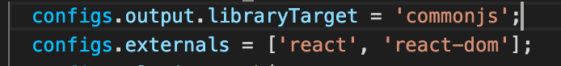
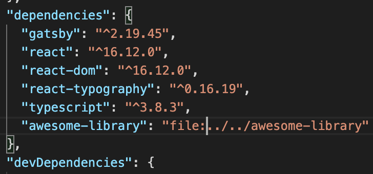

어느 정도 규모가 있는 프로젝트를 하다보면 범용적인 모듈이 생기게 되고, 그 부분은 따로 library화 하게 됩니다.

React.js, Next.js에서 React 라이브러리를 넣는다면 어떻게 될까요? 사실 큰 문제는 없습니다.
React.js 라이브러리는 `Material-UI`나 `Ant Design`, `React bootstrap` 등 이미 알려진게 많습니다.
이러한 라이브러리, 프레임워크를 사용할 때 큰 문제가 생기는 경우는 거의 없었구요.

하지만 직접 라이브러리를 프로젝트와 함께 만들다 보면 라이브러리를 만들다, 프로젝트를 하다, 하는 스위칭이 생기게 됩니다. 라이브러리가 수정되게 되면

- 라이브러리를 수정한다.
- package.json 버전을 올린다.
- publish
- 프로젝트에서 버전을 올려 다시 설치한다.

이와 같이 번거로운 과정을 지속적으로 거쳐야만 합니다.

# 중간에 잠깐!!! 참고!!!

라이브러리를 만들 때, webpack으로 제작 시 아래와 같이 `libraryTarget`설정과 `externals` 설정을 하였습니다.



`libraryTarget`은 library를 `umd`, `commonjs`, `esm` 등으로 사용할 수 있고, `externals`는 해당 library를 build할 때
포함하지 않는 옵션입니다.

---

이 과정을 줄이기 위해 npm package를 file path로 관리할 수 있습니다.



file path library는 `npm install` 명령어로 설치하게 되면 file path가 node_modules 내에서 symbolic link 연결이 되게 됩니다.
create react app으로 설치한 프로젝트에서 바로 실행해볼까요?


vscode에서 에러가 발생하지 않습니다. 바로 `npm start` 실행 후 브라우저에서 확인해보겠습니다.
그런데...?


- 올바르지 않은 hook의 호출. FC의 내부에서만 사용할 수 있고, 아래와 같은 이유로 문제가 발생합니다.
  - 1. react와 렌더러의 버전 미스매치
  - 2. hooks의 룰을 따르지 않고 있을 수 있음
  - 3. React 앱이 여러개일 수 있음

라이브러리와 프로젝트에서 1, 2번의 룰은 어기지 않았습니다. 의심이 가는건 3번입니다.
우선 [에러 문구 내의 링크](https://reactjs.org/link/invalid-hook-call)를 따라가봅시다.

[Duplicate React](https://reactjs.org/warnings/invalid-hook-call-warning.html#duplicate-react) 이슈가 3번에 해당하는 것으로 보입니다.

`npm ls react` 명령어를 실행해봅시다. 문제가 있다면 Error가 발생합니다.


라이브러리 내부에서도 react가 있는데 중복되는 라이브러리가 1개만 설치되어야 하는데 잘 되네요!

물론 이는 `awesome-library`에서 `peerDependencies` 설정 해놨기 때문입니다. 이는 내가 만든 모듈이 사용하는 특정 library가 다른 모듈과 함께 사용할 수 있다는 뜻입니다. 또한, `peerDependencies`에 들어가는 라이브러리는 `devDependencies`에 들어가면 `npm ls ***`에서 warning이 날 수 있으므로 `dependencies`에 넣어줘야 합니다.


이번엔 문서에서 체크해보라는 아래 코드를 실행해봅시다.

```js
// Add this in node_modules/react-dom/index.js
window.React1 = require('react');

// Add this in your component file
require('react-dom');
window.React2 = require('react');
console.log(window.React1 === window.React2);
```

`true`로 정상적으로 잘 나옵니다.


문서에 추가로 있는 [링크](https://github.com/facebook/react/issues/13991#issuecomment-435587809)도 확인해봅니다.

문서에 있는 해결방법 중 alias를 추가해보겠습니다.
alias는 node_modules를 가리키는 일반적인 방식에서 특정 name의 path를 직접 넣어주는 방식입니다.

```sh
# webpack config.resolve.alias
alias: {
  react: path.resolve('./node_modules/react')
}
```

TADA! 잘 나오게 됩니다.


이로써 React.js 프로젝트에서 React 라이브러리를 사용하는 부분이 잘 동작하게 되었습니다.

하지만!!!  
Next.js에서는 어떨까요?

```js
// next.config.js
module.exports = {
  ...
  webpack: (config, options) => {
    ...
    config.resolve.alias['react'] = path.resolve(__dirname, '.', 'node_modules', 'react');
  }
}
```

역시나 동일하게 webpack 설정을 하면 됩니다.

설정한 뒤에도 간헐적으로 처음에 보여드렸던 `invalid hooks` 관련 에러가 발생하기도 합니다.
이럴 땐 [next-transpile-modules](https://github.com/martpie/next-transpile-modules) 라이브러리를 사용하시면 됩니다.

종종 이러한 이슈가 발생되는지, 이럴때의 [해결책](https://github.com/martpie/next-transpile-modules#i-have-trouble-with-duplicated-dependencies-or-the-invalid-hook-call-error-in-react)에 대해 나와있고, 이 방법으로 해결도 해봤습니다.

```js
const withTM = require('next-transpile-modules')(['react']);

module.exports = withTM({
  ...
  webpack: (config, options) => {
    ...
+   if (options.isServer) {
+     config.externals = ['react', ...config.externals];
+   }

    config.resolve.alias['react'] = path.resolve(__dirname, '.', 'node_modules', 'react');
  }
})
```

---

Next.js, React.js 프로젝트 내에서 React.js 라이브러리를 file path로 사용하기 위한 삽질 내용을 정리해 보았습니다.

조금 당황스럽게도 Next.js 프로젝트에서 `withTM`과 `config.externals` 옵션 없이는 동작하지 않던 프로젝트가 블로그 글을 정리하면서 지우고 해봤을 땐, 잘 되더라구요;;; (이걸로 3일정도 삽질을 했는데 ㅠㅠ...)

당장은 이슈가 해결되었지만 누군가는 삽질을 할 수 있으니!! 도움이 되었으면 합니다.
