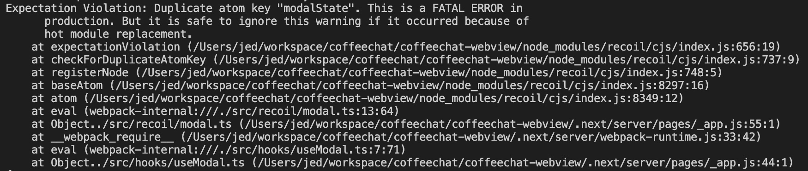

recoil을 사용해서 개발하다 보면 쉽게 마주칠 수 있는 warning이 있습니다.
바로 `Duplicate atom key "..."` 라는 warning 메세지 인데요,
HMR에서 발생한다곤 하지만, 꽤나 긴 메세지가 계속 콘솔을 채우고 있는걸 보자니
상당히 거슬립니다. 원인을 찾아 수정 해줘야겠습니다.



---

warning이 발생하는 원인부터 알아야겠습니다.

메세지에 있는 것처럼 HMR, 즉 유저의 파일 수정으로 인해 HMR을 통한 업데이트가 있을 때
기존에 정의해둔 Recoil의 atom이 재정의 되면서 키가 중복되는 상태가 되는 것입니다.

```ts
// 아주 기본적인 atom. 보통 global한 modal, popup을 위해 사용
...
import { atom } from 'recoil';

export const modalState = atom<IModalType | null>({
  key: 'modalState',
  default: null,
});
...
```

에러에 대한 [issue](https://github.com/facebookexperimental/Recoil/issues/733)는 금방 찾을 수 있었는데요, 20년도 11월 (2년전...)부터 있었던 이슈니 꽤 오래되었습니다.

공식적인 해결책은 없었고, 얼기설기 유저들이 테스트하며 해결하는 방법밖엔 없었습니다.
가장 깔끔했던 방법은 uuid 라이브러릴 통해 key값을 항상 다르게 만들어 주는 방법이었습니다.

```ts
import { atom } from 'recoil';
import { v1 } from 'uuid';

export const modalState = atom<IModalType | null>({
  key: `modalState/${v1()}`,
  default: null,
})
```

---

진행중이던 프로젝트가 적절히 마무리되고 동일한 메세지 때문에 한번 더 github issue를 확인하다 보니
2년만에...! 버그픽스가 되었다고 [0.7.6 릴리즈노트](https://github.com/facebookexperimental/Recoil/releases/tag/0.7.6)가 갱신되었다고 합니다.

```
1. recoil 패키지에서 RecoilEnv를 import 하고
"RecoilEnv.RECOIL_DUPLICATE_ATOM_KEY_CHECKING_ENABLED = false"
설정을 해준다.

2. nextjs와 같은 nodejs 환경에서
"process.env.RECOIL_DUPLICATE_ATOM_KEY_CHECKING_ENABLED=false"
와 같이 설정해줘도 된다.

* 참고로 정상적인 Duplicate atom key도 포함하여 모든 키갱신 에러를 체크하지 않음.
```

---

그리 중요하지 않은 내용이지만... 2년에 걸려 애써 무시하던 warning 메세지가가
공식적으로 해결할 수 있게 된것이 기뻐 기록으로 남겨봅니다
