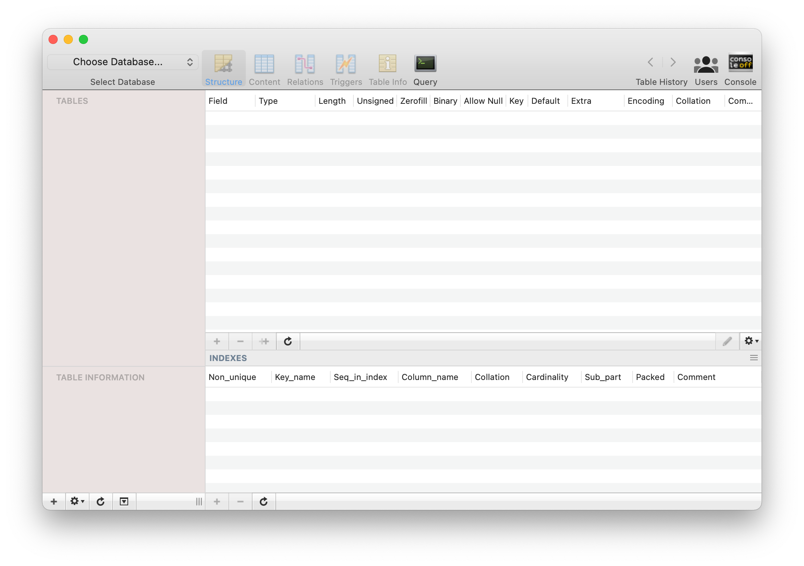

다른 블로그들에도 많은 내용이지만 오랜만에 mysql을 사용하려다 보니 생긴 문제와 해결책을 기록 해놓으려 합니다.

---

우선 mysql 설치는 brew를 통해 진행했습니다.

```sh
~ $ brew update
~ $ brew search mysql
==> Formulae
automysqlbackup          mysql ✔                  mysql++                  mysql-client             mysql-client@5.7         mysql-connector-c++      mysql-sandbox            mysql-search-replace     mysql@5.6                mysql@5.7                mysqltuner               qt-mysql

==> Casks
mysql-connector-python                             mysql-shell                                        mysql-utilities                                    mysqlworkbench                                     navicat-for-mysql                                  sqlpro-for-mysql
```

기왕 설치하는거 최신버전을 위해 mysql로 결정!

```sh
$ brew install mysql
```

설치된 버전은 8버전대. 어느새 많이 올라왔네요...

많이 사용하던 sequal pro를 설치했으나, 16년도에 마지막 릴리즈...? 불안한 마음이 스멀스멀... 합니다.

우선 mysql password 설정을 위해 `mysql_secure_installation` 커멘드를 입력합시다.
인터렉티브하게 설정이 가능해집니다.

```sh
~ $ mysql_secure_installation
Securing the MySQL server deployment.

# root user 비밀번호를 요구하네요
Enter password for user root: 
The 'validate_password' component is installed on the server.
The subsequent steps will run with the existing configuration
of the component.
Using existing password for root.

Estimated strength of the password: 100 
# 저는 기존에 설정이 되어있어서 비밀번호를 바꿀지 물어봅니다.
Change the password for root ? ((Press y|Y for Yes, any other key for No) : N

 ... skipping.
By default, a MySQL installation has an anonymous user,
allowing anyone to log into MySQL without having to have
a user account created for them. This is intended only for
testing, and to make the installation go a bit smoother.
You should remove them before moving into a production
environment.

# 제일 처음에 있던 익명 유저정보를 지울 것인지
Remove anonymous users? (Press y|Y for Yes, any other key for No) : Y
Success.


Normally, root should only be allowed to connect from
'localhost'. This ensures that someone cannot guess at
the root password from the network.

# root 계정으로 원격 접근을 막을 것인지 입니다.
Disallow root login remotely? (Press y|Y for Yes, any other key for No) : Y
Success.

By default, MySQL comes with a database named 'test' that
anyone can access. This is also intended only for testing,
and should be removed before moving into a production
environment.

# 존재하던 test db를 지울지 물어보네요.
Remove test database and access to it? (Press y|Y for Yes, any other key for No) : Y
 - Dropping test database...
Success.

 - Removing privileges on test database...
Success.

Reloading the privilege tables will ensure that all changes
made so far will take effect immediately.

# 권한 정보를 갱신할 것인지 물어보네요
Reload privilege tables now? (Press y|Y for Yes, any other key for No) : Y
Success.

All done! 
```

자 이렇게 설정 해줬으니 sequal pro에서 root 계정으로 password 입력하면 잘 되겠지~?


ㅠㅠ 안되니까 글을 쓰고 있겠죠...

mysql 8 버전에서 암호화 방식이 바뀌어서 암호화 방식을 다시 세팅해줘야 한다고 합니다. root뿐만 아니라 추가 user들 모두요!

```sh
~ $ mysql -uroot -p
password:

...

mysql > ALTER USER 'yourusername'@'localhost' IDENTIFIED WITH mysql_native_password BY 'youpassword';
```



끝.