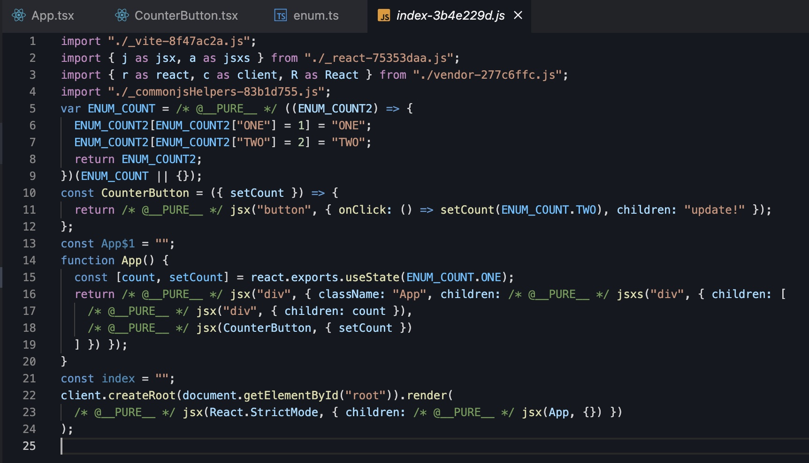
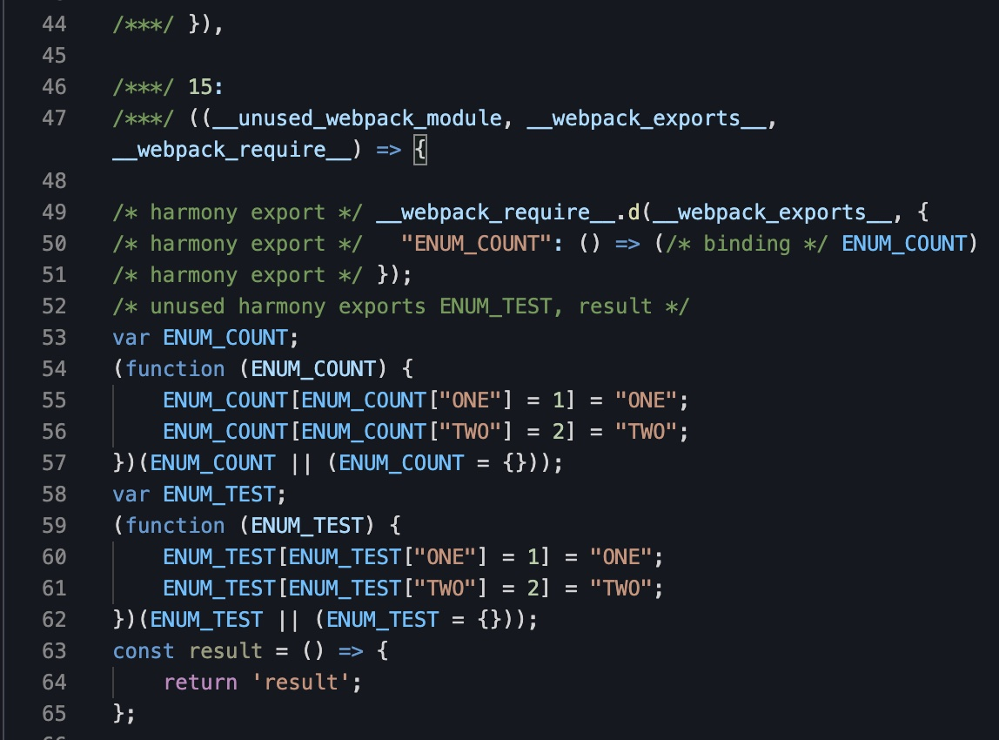
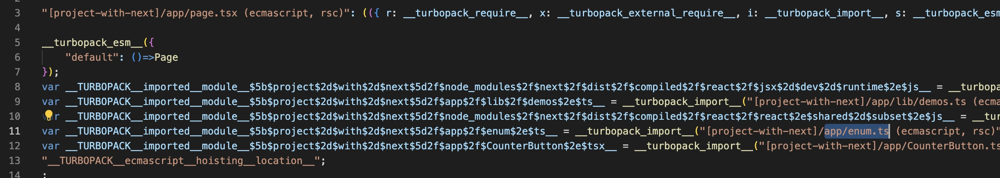
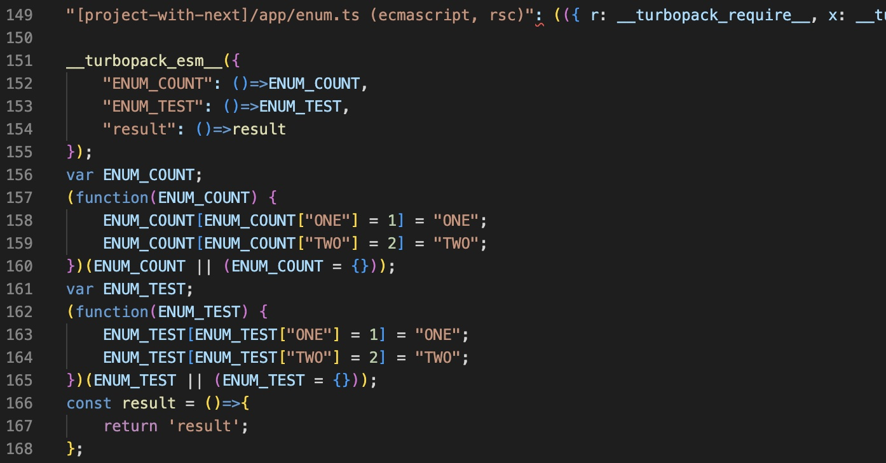

typescript를 쓰면서 enum은 아주 귀찮은 녀석입니다. 사용할땐 아주 편하지만, 빌드를 하면 tree shaking이 되지 않고
사용하는 chunk에서 각각 긴~~~ enum 코드들을 가지고 있게 됩니다.

[라인 엔지니어링 블로그에 올라왔던 typescript enum tree shaking](https://engineering.linecorp.com/ko/blog/typescript-enum-tree-shaking/)에 관한 글인데,
이 글이 enum tree shaking 문제에 대해 문제를 제기했던 (처음인지는 모르겠지만) 가장 널리 알려진 글인것 같습니다.

어디서 `vite에서는 enum이 tree shaking이 된다` 는 글을 보고 `오, 다른 번들러는 안되나?` 라는 생각이 들어서 테스트를 좀 해보려고 합니다.
코드는 거의 동일하며 번들러의 config 파일만 다르게 돌려보려 합니다.

```tsx
// /src/main.tsx
import { StrictMode } from 'react';
import * as ReactDOM from 'react-dom';

import App from './app';

ReactDOM.render(
  <StrictMode>
    <App />
  </StrictMode>,
  document.getElementById('root')
);
```

```tsx
// /src/app.tsx
import { useState } from 'react';
import { CounterButton } from './CounterButton';
import { ENUM_COUNT, ENUM_TEST } from './enum'; // 사용하는 ENUM_COUNT, 사용하지 않는 ENUM_TEST

export function App() {
  const [count, setCount] = useState<ENUM_COUNT>(ENUM_COUNT.ONE);

  return (
    <div className="App">
      <div>
        <div>{count}</div>
        <CounterButton setCount={setCount} />
      </div>
    </div>
  );
}
export default App;
```

```tsx
// /src/CounterButton.tsx
import { Dispatch, SetStateAction } from 'react';
import { ENUM_COUNT } from './enum';

interface IProps {
  setCount: Dispatch<SetStateAction<ENUM_COUNT>>;
}

export const CounterButton = ({ setCount }: IProps) => {
  return <button onClick={() => setCount(ENUM_COUNT.TWO)}>update!</button>;
};
```

```ts
export enum ENUM_COUNT {
  ONE = 1,
  TWO = 2,
}

export enum ENUM_TEST {
  ONE = 1,
  TWO = 2,
}

export const result = () => {
  return 'result';
};
```

위 코드를 가지고 여러 번들러들을 바탕으로 build를 돌려보겠습니다.
기본적으로 react + typescript가 돌아가는 것을 제외하고 추가해야 하는 옵션들은

- build 결과물을 확인하기 위해 minify를 false로
- 보기 쉽게 chunk 파일을 분리, node_modules는 왠만하면 제거

이 정도가 기본적으로 필요합니다.

## vite

우선 vite는 아주 간단합니다.

```js
import { defineConfig } from 'vite';
import react from '@vitejs/plugin-react';

export default defineConfig({
  plugins: [react()],
  build: {
    minify: false,
    rollupOptions: {
      output: {
        manualChunks: (id) => {
          if (id.includes('node_modules')) {
            // node_modules는 vendor로 뻄
            return 'vendor';
          } else {
            // 나머지는 결로를 제외하고 파일명 그대로로 build 결과물을 만듬
            const fileName = id.split('/')[0];
            return fileName.split('.')[0];
          }
        },
      },
    },
  },
});

```


`yarn build` command를 통해 위와 같은 결과물이 나옵니다.
_commonjsHelpers-*.js, _react-*.js, _vite-*.js 파일들은 vendor 결과물을 쉽게 쓰기위한 코드들로, 무시해도 됩니다.
결국 vendor-*.js를 제외한 순수 코드는 index-*.js 파일밖에 없습니다.



코드를 보면 `ENUM_COUNT`는 하나만 잘 나오고 있습니다. enum.ts에서 정의만 하고 사용하지 않은 `ENUM_TEST` enum이나 result 함수는 나와있지 않습니다.
`app.tsx` 에서 사용하지 않는 enum의 `ENUM_TEST` enum을 넣어주기도 했고, enum.ts의 사용하지 않는 `result` 함수도 나오지 않고 있습니다.

---

## webpack
[webpack에서는 tree shaking을 별도로 설정](https://webpack.js.org/guides/tree-shaking)해줘야 합니다. (벌써부터 복잡...)

```js
// webpack.config.js
optimization: {
  usedExports: true,
},

// package.json
{
  "sideEffects": false
}
 ```

webpack의 config 파일을 보겠습니다.

```js
const path = require('path');
const HtmlWebpackPlugin = require('html-webpack-plugin');

module.exports = (env, options) => {
  return {
    entry: './src/main.tsx',
    target: 'web',
    mode: 'none',
    watch: true,
    module: {
      rules: [
        {
          test: /\.tsx?$/,
          use: 'ts-loader',
          exclude: /node_modules/,
        },
      ],
    },
    optimization: {
      usedExports: true, // tree shaking
      splitChunks: { // chunk
        chunks: 'all',
      },
    },
    resolve: { extensions: ['.tsx', '.ts', '.js'] },
    output: {
      filename: '[name].bundle.js',
      path: path.resolve(__dirname, 'dist'),
      publicPath: '',
    },
    plugins: [
      new HtmlWebpackPlugin({
        template: './src/index.html',
        inject: true,
        minify: false,
      }),
    ],
  };
};
```

mode를 `development`로 설정하면 코드가 string처리 되기 때문에 보기 쉽도록 none으로 처리했습니다.
이제 `yarn build` 커멘드를 돌려보도록 하겠습니다.

코드의 첫 시작 파일인 `main.bundle.js`가 만들어집니다.
실제 코드량은 많지 않지만 vite에 비해 모듈 캐시라는 이름으로 작성한 코드량의 2배 이상이 잡혀있습니다.

중요한 tree shaking은...? 역시나 정상적으로 동작하진 않았습니다.



enum 코드 부분에선 `/* unused harmony exports ENUM_TEST, result */` 라는 주석이 있긴 하지만 코드는 그대로 유지됩니다.


ENUM_COUNT를 사용하고, ENUM_TEST를 import한 App에서는 `_enum__WEBPACK_IMPORTED_MODULE_2__` 를 통해 enum 파일을 require 했습니다.
따라서 언제든 정의되어 있는 ENUM_TEST enum이나 resuilt 함수를 접근할 수 있는 상황인거죠. 물론 사용하진 않았지만요.

---

## turbopack

next.js 생태계에서 핫한 turbopack입니다.
vite, webpack과 다르게 next.js에 초점이 맞춰져 있는데요, turbopack에서는 enum이 사용 가능할까요?

`npx create-next-app --example with-turbopack` 명령어로 nextjs turbopack 예제를 생성합니다.
turbopack의 별도의 설정파일이 보이지 않습니다. 원래 next.config.js 내부에 webpack 코드를 custom할 수 있도록
`webpack` 프로퍼티를 가지고 있는데, turbopack 설정도 여기서 가능할지 찾아봤으나, 별도의 프로퍼티는 존재하지 않았습니다.
문서 또한 보이지 않네요. 자세한건 더 살펴봐야 하겠지만, 흥미롭습니다.

해당 프로젝트의 코드를 모두 지우고 `app/page.tsx`를 기존 `App.tsx`처럼 사용하여 동일한 코드를 넣어보겠습니다.

`yarn dev`로 실행하면 .next 경로가 업데이트 됩니다. 저희가 확인해볼 파일은
`.next/server/app/chunks/rsc/app_page.tsx.js` 경로에 있는 파일입니다.



page.tsx에서 enum.ts를 호출하는 부분입니다. export가 아닌 파일 전체를 require 하듯 import하고 있습니다.


변수명이 너무 길어 중간부를 생략해놨는데요, webpack과 비슷한 형태로 `__turbopack_import__` 를 통해
파일을 전체 import 하고, 파일에 접근하기 때문에 enum.ts에 ENUM_COUNT, ENUM_TEST, result가 모두
사전 정의 되어있을 것입니다.



역시나 webpack처럼 정의가 잘 되어있네요.

---

많이 사용하던, 그리고 사용하고 있는 webpack과 vercel에서 밀고있는 turbopack은 아직 enum의 tree shaking을
지원해주지 않습니다. 테스트 해보지 않았지만 rollup 또한 enum의 treeshaking이 가능하다고 하며, vite도
treeshaking이 되고 있음을 확인할 수 있었습니다.

const enum, enum, union 중 아직까진 union 타입을 사용하고 있는데, 이런 번거로움을 해결하기 위해 vite를 쓰는것도
나쁘지 않을 것 같습니다.

이런 사소한 번들링 최적화는 서비스 개발 시 우선순위에서 많이 떨어지는데, 개발자라면 응당 바쁜시간 쪼개서 해결해야 하지 않을까
스스로도 아쉬움이 많이 듭니다.
