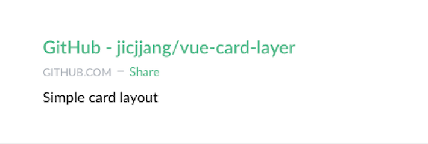

워후! 사실 길게 쓸 포스팅은 아니지만 혼자 신이나서 작성해봅니다 ㅋㅋ
몇달 전 Vue를 공부하고나서 심심풀이로 만들었던 라이브러리가
저도 모르게 [Vue.js News](https://www.getrevue.co/profile/vuenewsletter/issues/vue-js-newsletter-45-vueconf-guide-new-speaker-typescript-starter-articles-videos-and-resources-57309)
에 소개되었었네요 ㅋㅋ

뭔가 열심히 코딩을 할 계기가 하나 더 생긴 것 같아 기쁩니다 :D 헤헤
