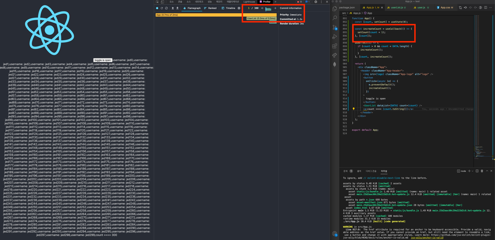
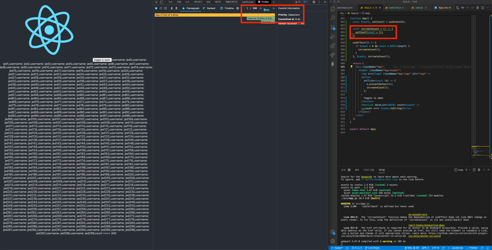

LINEVOOM Renewal을 할 때의 UI Library는 React를 사용하였습니다. React를 LINEVOOM Renewal 이전에도 계속 사용했었지만 React hooks, 그중에서도 useCallback은 함수를 재사용할 수 있게 해준다는 것만 알고 정확히 언제 사용해야 하는지 모른채 무분별하게 사용하고 있었습니다.
언제 사용해야 하는지 정확히 알고 사용하기 위해 기본적인 내용 이더라도 다시 알아보려 합니다.

자바스크립트에서 함수란 객체입니다. 그렇기에 (완벽하게)동일한 역할을 하는 함수를 비교하더라도 그 값이 같을 수 없습니다.

```js
import React from 'react';

export default function ComponentA() {
  // 렌더링마다 새롭게 생성됨
  const onClick = () => {
    console.log('Click!');
  }

  return ...
}
```

React에서도 마찬가지 입니다. Component 내부 함수는 렌더링마다 새롭게 생성되며 생성될 때마다 그 값이 다르게 됩니다.
하지만 이는 유저들에게 낭비로 여겨집니다. 항상 같은일을 하는 함수인데 새롭게 생성하고 있으니까요.

```js
import React, { useCallback } from 'react';

export default function ComponentA() {
  // 최초 렌더링 시 생성된 함수가 유지됨 (동일 object)
  const onClick = useCallback(() => {
    console.log('Click!');
  }, []);

  return ...
}
```

이를 해결하기 위해 useCallback으로 함수를 감싸줍니다. 해당 함수는 최초 렌더링 시점에 함수가 생겨나 할당된 object와 완전히 동일합니다.

```js
import React, { useCallback } from 'react';

export default function ComponentB({ postListId }) {
  // 최초 렌더링 시 생성된 함수가 유지됨 (동일 object)
  const clickEvent = useCallback((postId) => {
    console.log(`Click ${postId} in ${postListId}`);
  }, [postListId]);

  return <PostList postListId={postListId} clickEvent={clickEvent} />
}
```

```js
import React from 'react';

export default function PostList ({ postListId, clickEvent }) {
  const postListData = useSelectPostList(postListId); // postList를 가져오는 selector
  return postListData.map((post) => <Post post={post} clickEvent={clickEvent} />);
}
```

```js
import React from 'react';

function Post ({ post, clickEvent }) {
  const { postId, username, blahblah } = post;
  return <div onClick={clickEvent}>{postId}, {username}, {blahblah}</div>;
}

// React.memo는 자주 바뀌는 component에 사용하면 좋음. 무분별한 사용은 x
// 자주 바뀌지 않는 component에 사용한다면, 업데이트도 별로 없는데 렌더링마다 비교해야되는 귀찮은 일이 생김.
export default React.memo(Post);
```

이번에는 `ComponentB`에서 `PostList`를 사용할 때의 함수를 살펴보겠습니다. `ComponentB`에서의 `clickEvent`는 `ComponentB`의 업데이트 여부와 상관없이 `postListId` 여부로 재생성 여부를 결정하게 됩니다. 물론 내부에서 postListId를 호출하고 있으니까요.

---

궁금했던 부분은, `그렇다면 비순수 함수인 경우에는 무조건 useCallback을 감싸고 의존성을 넣어주는게 좋겠네?` 였습니다.

대다수 블로그 아티클들은 `inline 함수는 useCallback으로 감싸는 것이 성능에 좋다`라고 하였지만, useCallback 자체를 호출하고 의존성을 관리하는 비용이 있기 때문에 꼭 그렇지만은 않습니다.

```js
...
  const [isOpen, setIsOpen] = useState(false);

  const toggleIsOpen = () => setIsOpen(!isOpen);
...
```

만약 inline함수의 useCallback 부분이 위와 같을 때, 아래 코드처럼 useCallback으로 감싸는게 성능 향상에 큰 도움이 될 것이라 생각되시나요?

```js
...
  const [isOpen, setIsOpen] = useState(false);

  const toggleIsOpen = useCallback(() => setIsOpen(!isOpen), [isOpen]);
...
```

테스트를 진행해보겠습니다. cra를 통해 만든 간단한 앱 입니다.

```js
const DATA = [{username: 'jed0'}, {username: 'jed1'}, .... {username: 'jed299'}]; // 300개의 데이터

function App() {
  const [count, setCount] = useState(0);

  // 이 함수가 useCallback으로 쌓일지 말지 결정될 함수
  const increateCount = () => {
    setCount(count + 1);
  };

  useEffect(() => {
    if (count > 0 && count < DATA.length) {
      increateCount();
    }
  }, [count, increateCount]);

  return (
    <div className="App">
      <header className="App-header">
        
        <button
          onClick={(e) => {
            e.preventDefault();
            increateCount();
          }}
        >
          toggle is open
        </button>
        <UserList dataList={DATA} count={count} />
        <a>
          count => {count.toString()}
        </a>
      </header>
    </div>
  );
}

export default App;
```

```js
import React from "react";

import User from "./user";

export default function UserList({ dataList, count }) {
  return dataList
    .filter((v, i) => i < count)
    .map((data, i) => <User key={i} user={data} />);
}
```

```js
import React from "react";

function User({ user }) {
  return <span>username: {user.username}</span>;
}

export default React.memo(User);
```

300 번의 re-render를 일으키기 위해 한번 버튼을 클릭한 이후, useEffect 시점에 state인 `count`값을 변화시켰고, `count`값으로 `userList.js`에서 filter로 dataList의 노출 개수를 조절했습니다.




첫번째 요소를 그릴때의 Commited at은 1.3s, 300번째 요소를 그릴때의 Commited at은 3.4s 입니다. user로만 약 2.1s가 소요되었네요. (3 ~ 4번의 실측 결과 2.1s ~ 2.5s의 결과가 나옴)

이번에는 useCallback을 제거한 뒤 테스트를 진행해보겠습니다.




몇번의 실측을 거쳤지만, 역시 2.1s가 나왔네요 (이 또한 2.1s~2.5s 정도의 결과가 나왔음)

300번의 반복적인 re-render를 일으키지만 useCallback으로 복잡한 의존성을 가지지 않는 함수에 대해서는 큰 성능 차이가 발생하지 않음을 알 수 있었습니다.

---

서비스를 진행함에 있어서 useCallback 뿐만 아니라 성능을 위해 memoization을 해주는 React.memo, useMemo와 같은 기능들도 어느정도 무분별하게 사용하는 감이 있습니다 (깊은 반성...😭) 실제로 무분별하게 성능을 위해 reselect를 하다 오히려 GC가 제대로 동작하지 않는 문제를 겪기도 했었구요...

앞으로는 더 기능들에 대해 명확히 파악하고 개발을 진행 해야겠습니다. (항상 마무리가 어렵네요. 끝!)