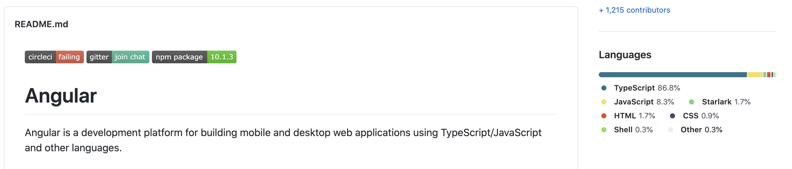
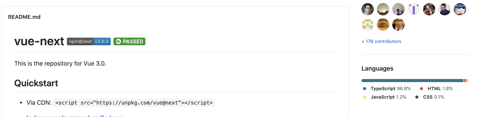
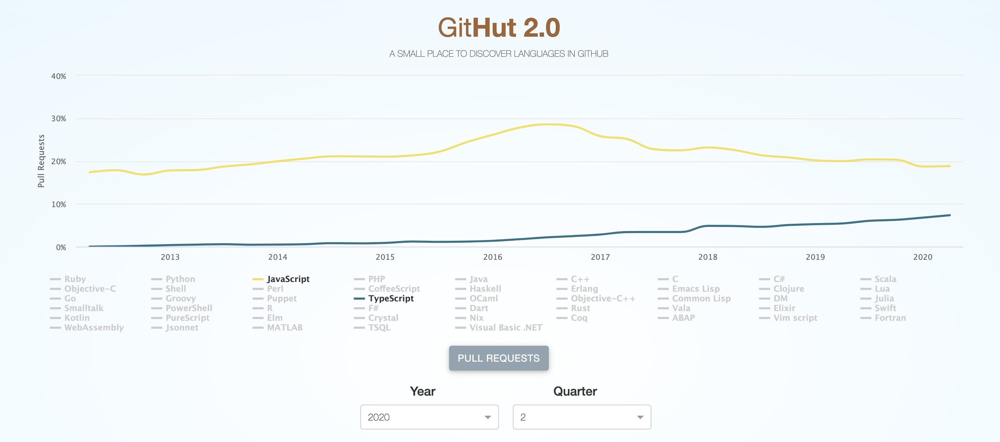
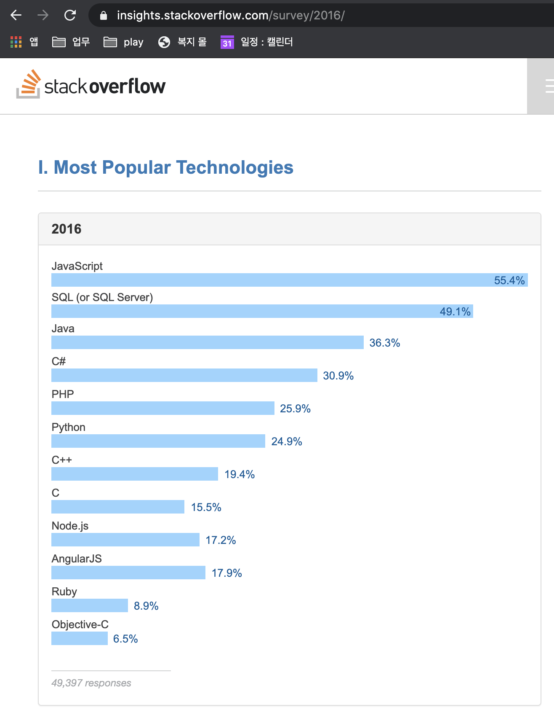
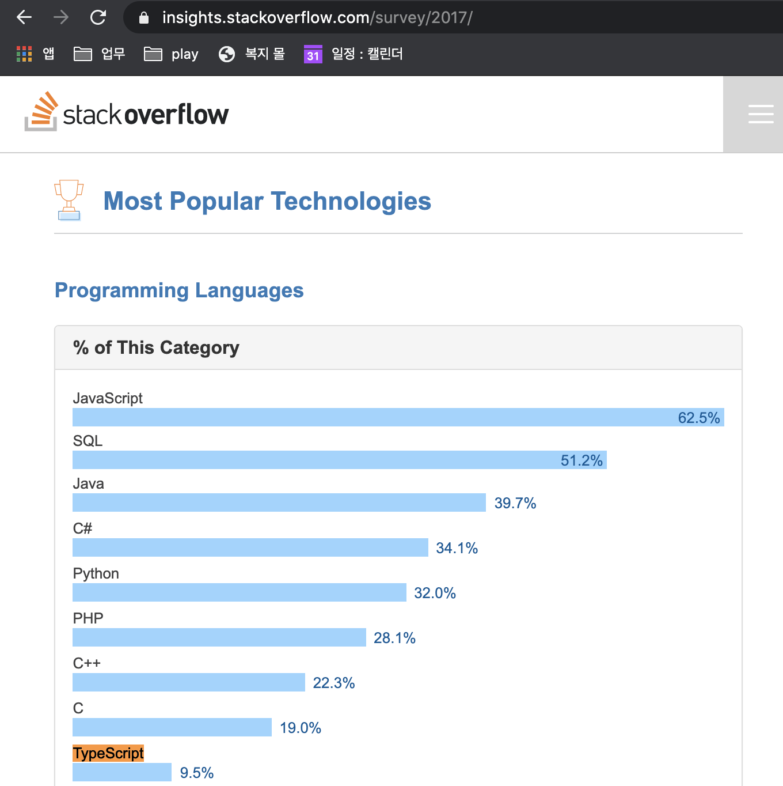
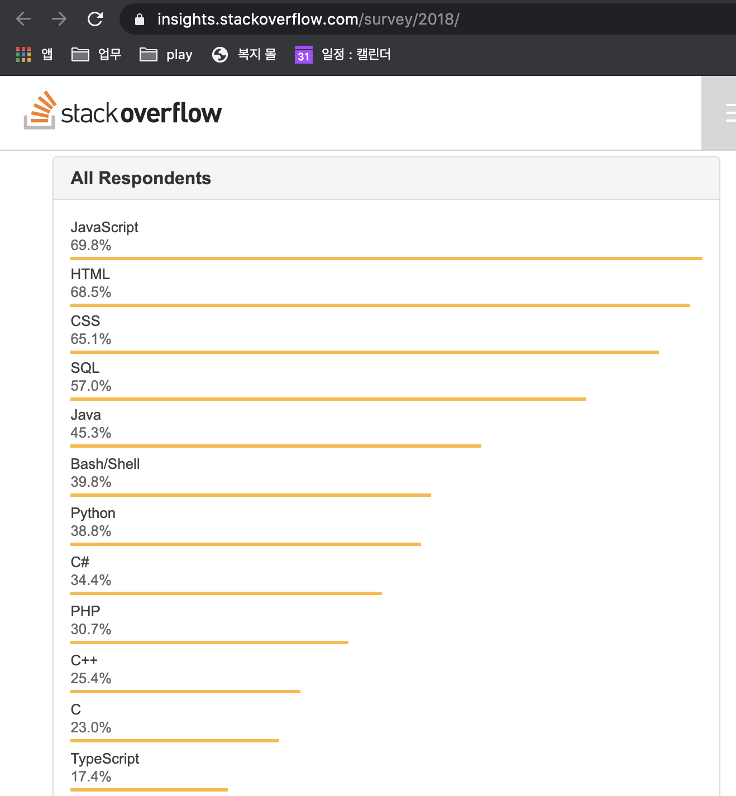
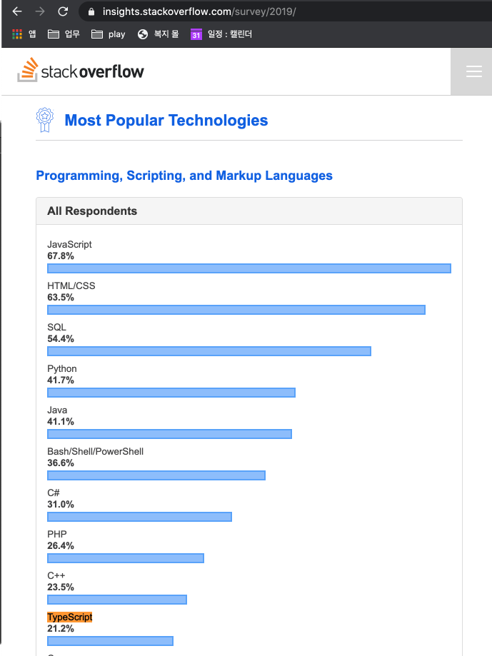
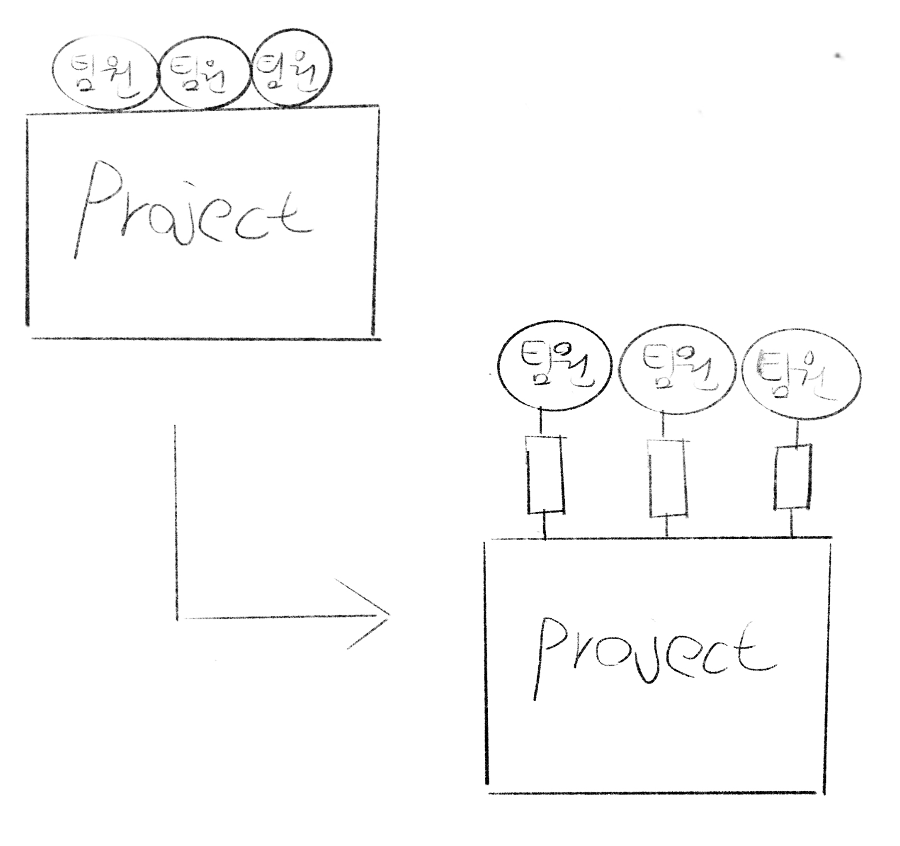

# SPA Library 3대장을 비교해보자

- Angular
    - 뭐... 애초에 Angular에서 사용하면서 유명해진 것은 모두 아는 사실

    

- React
    - React를 만든 facebook팀에선 [PropTypes](https://github.com/facebook/prop-types) 라는 런타임 타입 체킹 라이브러리를 만듬
    - 자체 타입 체킹 툴을 만든 팀이 타 라이브러리를 쓰기는 조금 애매함
- Vue
    - 이미 타입스크립트 사용 중!
        - [하지만 완전 갈아엎을 수 없으므로... vue를 한번 감싸는 방식으로 사용ㅠ](https://v3.vuejs.org/guide/typescript-support.html#defining-vue-components)

    

# 언어의 상승 추이

- [GitHut 지표 참고](https://madnight.github.io/githut/#/pull_requests/2020/2)



### 16년도 (js 55.4%, ts 없음)



### 17년도 (js 62.5%, ts 9.5%)



### 18년도 (js 69.8%, ts 17.4%)



### 19년도 (js 67.8%, ts 21.2%)



### js의 성장률 = 4.13%

### ts의 성장률 = 7.06%

### * 여기서 참고할 점. ts를 사용하려면 js자체가 바탕이 되어야 함. ts를 사용한다면 js의 사용 빈도도 늘어난다는 얘기이다 (!!!)

# 도입 하고자 하는 이유

- 저 또한 typescript를 처음 배우는 시점에선 개인 프로젝트를 할 때 javascript를 사용하였습니다. 익숙하지 않았으니까요. 익숙해진 이후론 typescript가 없는게 오히려 이상하고, mobx와 같이 inject, observer에 대한 변수가 사방팔방 퍼져있어서 변화를 추적하기 특히나 어려운 경우엔 javascript로 짜면 제가 짠 코드도 이해를 할 수 없었습니다.
- 팀 프로젝트에선 어느정도 정형화 된 타입이 있어야 서로 오해없이, 다른 개발자가 짠 코드를 쉽게 이해할 수 있습니다.
    - 오해 ⇒ 만든이는 api에서 10이란 숫자가 넘어올 것을 알고 개발함. 하지만 `'10'` 이라는 string값이 오는 것이었음 (혹은 서버 개발자가 타입을 변경해버림!!!). 타 개발자가 이 부분을 수정할 때 코드만 보고 해당 내용을 이해할 수 있는가?
    - 누군가 대규모 프로젝트에서 prototype를 수정하고 인수인계를 안해줬다고 한다면... 감당할 자신이 있는가?
- 팀원들이라는 모듈이 프로젝트와 팀원 모두 라는 서비스에 강하게 결합되어 있는데, 팀원들 개개인과 프로젝트 사이에 인터페이스를 두자는 얘기로 봐주시면 될 것 같습니다.

    

# 비 Typescript 유저의 걱정

- 러닝커브
    - 배우는데 얼마나 걸리려나...
- 생산성 저하
    - 타입을 넣는 거라면, 결국 코드량이 증가할거고 생산성이 저하되지 않을까?
    - 이 변수에 어떤 값이 오는거지? 라는 생각을 팀원마다 1번씩 하고, 10명이 1번씩하면 10번을 생각하고, 이런 변수가 10개있고... 이런 경우보단 타입을 한번 정의해서 어떤 타입인지 명확히 알게 하면, 결국 나중엔 생산성이 오히려 올라갈 수 있습니다.
- 자바를 쓸 때 처럼 강타입의 타입 체킹..?
    - 타입 체킹 레벨은 팀 협의 하에 조절 가능합니다!
    - 아무 타입이나 넣을 수 있는 any. any타입을 허용할지 말지에 대한 부분도 tsconfig 설정으로 조절 가능!
    - 물론 [옵션의 종류는 많습니다](https://vomvoru.github.io/blog/tsconfig-compiler-options-kr/). 하지만 하면서 나오는 불필요한 타입 체킹에 대해서는 팀 논의 후 조절하면 됩니다.
- 업데이트는 제대로 돼?
    - 지난달(20년 8월) [4 버전대](https://devblogs.microsoft.com/typescript/announcing-typescript-4-0/)가 나왔습니다.
    - 1달 만에 4.1버전 beta버전이 나온상황입니다.
        - 자세한 내용은 [업데이트 히스토리](https://devblogs.microsoft.com/typescript/)를 참고해주세요.
- 사용자는 괜찮아? 문서는?
    - 상단의 `언어의 상승추이` 를 보시면, 점차 성장하는 모습을 보실 수 있습니다.
    - 위에 말씀드린 [4 버전대에 대한 핸드북이 한글 번역](https://typescript-kr.github.io/pages/release-notes/typescript-4.0.html)되어 이미 나왔으며, 검색해보시면 4.0 버전에 대한 내용이 수두룩하니 나옵니다 :)
    - 지금까지 typescript로 개발하면서 해결하지 못한 이슈는 없습니다. 물론 복잡도 높은 generic (필수는 아니지만요) 문법은 저도 잘 사용하진 못합니다 ^^;
- 자바스크립트로만 작성된 라이브러리, 프레임워크를 typescript로 어떻게 사용하는가?
    - [DefinitelyTypes](https://github.com/DefinitelyTyped/DefinitelyTyped/tree/master/types) 라는 repo가 있습니다. 해당 레포는 package.json에서 `@types/***` 경로로 설치가 됩니다.
    - typescript의 type에 대한 기본 경로이며, `typescript로 되어있지 않은 코드는 **.d.ts라는 파일을 만듬으로써 타입스크립트가 쓸 수 있는 인터페이스를 만들어준다. (해당 파일 경로는 기본이 @types/~ 이며, tsconfig에서 설정 가능)` 라고 생각해주시면 될 것 같습니다.
        - [제가 했던 커리큘럼](https://git.linecorp.com/LINE-FE-Welcome/introduce-junseok-liff) 을 보시면 아래와 같이 `/src`경로를 추가해 주었고, `/src`안에 `[global.d.ts](https://git.linecorp.com/LINE-FE-Welcome/introduce-junseok-liff/blob/master/src/global.d.ts)`라는 파일을 두었습니다. 해당 파일은 html, image files를 불러오기 위한 file-loader를 통해 이미지를 불러올 때 typescript로 사용하기 위함입니다.

        ```jsx
        // /tsconfig.json
        {
          "compilerOptions": {
            ...
            "typeRoots": [
              "./node_modules/@types",
              "./src"
            ],
            ...
          }
        }

        //---------------------------------------------
        //---------------------------------------------
        //---------------------------------------------

        // /src/global.d.ts
        declare module '*.html' {
          const content: string;
          export default content;
        }

        declare module "*.jpg" {
          const value: string;
          export = value;
        }

        declare module "*.png" {
          const value: string;
          export = value;
        }
        ```

# 안정성

- type을 사용하는 근본적인 이유는 안정성이라고 생각했었습니다.
    - 하지만 안정성은 test code로 보충해야 하죠 ㅎㅎ
- 약타입의 타입을 줌으로써, 다른 타입의 값을 넣었을 때 확실한 값을 넣어달라는 푸시를 개발자에게 줄 수 있습니다.
    - 안타깝게도 특정 라인에 `[// @ts-ignore` 라는 플래그](https://stackoverflow.com/questions/51145180/how-to-use-ts-ignore-for-a-block)를 넣음으로써 바로 아래 1개의 라인만 코드를 무시할 수 있게 하는 기능은 Deprecated 되어가고 있는 듯 합니다.
- 버그를 줄이고, 코드의 정확성을 높일 수 있습니다.

# 생산성

- 새로운 도구를 사용하는데, 처음엔 당연히 생산성이 떨어질 수밖에 없습니다.
- javascript의 슈퍼셋이다. 처음부터 100퍼센트로 프로젝트를 커버하지 않아도 된다. 넣고싶은 부분에만 코드를 넣을 수 있습니다.
- javascript와 혼용 또한 가능! tsconfig에서 물론 설정 가능 ㅎㅎ
- 해당 문서를 정리하며 인터넷을 찾아보니 `타이핑 수가 늘어난다, 코드양이 늘어난다` 등의 내용이 있었습니다.
- 참고로 vscode, webstorm 모두 타입스크립트 지원 기능이 내장되어 있기 때문에 별도의 설정 없이도 타입스크립트 파일 및 tsconfig.json 파일을 인식할 수 있고 코드 검사, 빠른 수정, 실행 및 디버깅 등의 다양한 기능을 바로 사용할 수 있습니다. (단, 컴파일러는 포함되어 있지 않기 때문에 별도로 설치해야 합니다.)

# 논문

- [뜬금없이 왠 논문...?](http://earlbarr.com/publications/typestudy.pdf)
- 제일 상단의 Abstract만 읽어보셔도 됩니다.
- **개발 과정에서 flow, typescript로 중요한 버그를 `15%` 성공적으로 발견할 수 있다고 합니다.**

# 다른 타입의 도구도 있지 않느냐

- flow
    - 로드맵이 없네요... ([위키](https://github.com/facebook/flow/wiki/3rd-party-tools)) ([공식 홈페이지](https://flow.org/blog/))
- 커피스크립트, elm 등... 사실 들어본적이 거의 없습니다.

# 타입스크립트의 목표

- [한번 읽어보면 좋습니다.](https://github.com/Microsoft/TypeScript/wiki/TypeScript-Design-Goals)

### 레퍼런스

- [레딧에서 typescript를 도입하게 된 이유 (번역)](https://medium.com/@constell99/%EC%9A%B0%EB%A6%AC%EA%B0%80-typescript%EB%A5%BC-%EC%84%A0%ED%83%9D%ED%95%9C-%EC%9D%B4%EC%9C%A0-b0a423654f1e)
- [저와 비슷한 내용의 글](https://hyunseob.github.io/2018/08/12/do-you-need-to-use-ts/)

### 인용 & 참고

- [https://github.com/h2oche/typescript-summary](https://github.com/h2oche/typescript-summary)
- [https://heropy.blog/2020/01/27/typescript/](https://heropy.blog/2020/01/27/typescript/)